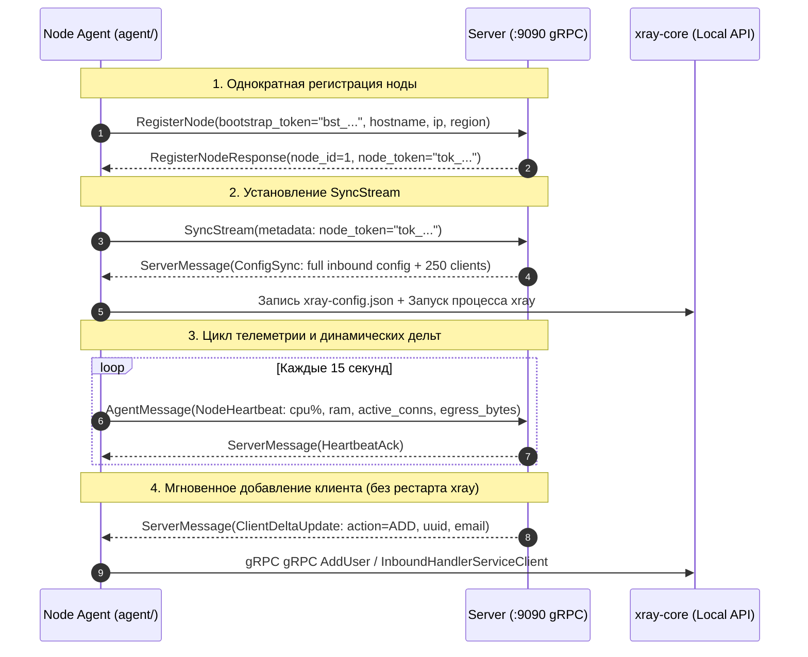

# gRPC Control Plane: Контракт vpn.agent.v1 (agent.proto)

Определение протокола: `proto/vpn/agent/v1/agent.proto`.  
Реализации: Сервер `GrpcAgentService.java` (порт `:9090`), Агент ноды `agent/src/grpc-client.ts`.

---

## 1. Архитектура и сетевая модель

::: tip ПРИНЦИП ZERO INBOUND PORTS
VPN-нода не открывает никаких портов управления (SSH/gRPC наружу закрыты). Агент на TypeScript при старте сам инициирует **исходящее соединение** на сервер по mTLS gRPC:
`agent (выход) ───[mTLS gRPC :9090]───> server (вход)`
:::

* **Транспорт**: HTTP/2 поверх mTLS (взаимная TLS-аутентификация с валидацией корневого сертификата CA).
* **Аутентификация вызовов**: gRPC Metadata Header `node_token: <NODE_LONG_LIVED_TOKEN>`.
* **Тип потока**: Бидирекциональный стрим (`bidirectional streaming RPC`), поддерживающий долгоживущую связь с отправкой heartbeat каждые 15 секунд.



---

## 2. Сервисы Protobuf

```protobuf
syntax = "proto3";

package vpn.agent.v1;

option java_multiple_files = true;
option java_package = "com.vpn.server.grpc";
option go_package = "vpn/agent/v1;agentv1";

service AgentRegistrationService {
  rpc RegisterNode (RegisterNodeRequest) returns (RegisterNodeResponse);
}

service AgentStreamService {
  rpc SyncStream (stream AgentMessage) returns (stream ServerMessage);
}
```

---

## 3. Спецификация сообщений `AgentMessage` (Node $\rightarrow$ Server)

Сообщение-обёртка `AgentMessage` использует конструкцию `oneof body`:

```protobuf
message AgentMessage {
  string node_id = 1;
  int64 timestamp = 2; // Unix ms
  oneof body {
    NodeHeartbeat heartbeat = 3;
    ConfigAck config_ack = 4;
    TrafficStatsReport traffic_stats = 5;
    ConnTelemetryReport telemetry = 6;
  }
}
```

### 3.1. `NodeHeartbeat` (Телеметрия ноды)
Отправляется агентом каждые 15 секунд. Сервер использует эти данные для расчёта алгоритма динамического скоринга V7:

| Поле | Тип | Описание |
|---|---|---|
| `cpu_percent` | `float` | Загрузка процессора за последний интервал (0.0 — 100.0) |
| `cpu_count` | `int32` | Количество ядер CPU на хосте |
| `memory_used_bytes` | `int64` | Занятая оперативная память хоста в байтах |
| `memory_total_bytes` | `int64` | Полный объём оперативной памяти |
| `uptime_seconds` | `int64` | Аптайм процесса агента в секундах |
| `active_connections` | `int32` | Число активных клиентских сессий через `xray-core` |
| `recent_egress_bytes_per_sec` | `int64` | Текущая пропускная способность исходящего канала (B/s) |
| `xray_pid` | `int32` | PID дочернего процесса xray-core |

### 3.2. `TrafficStatsReport` (Пользовательский трафик)
Отправляется каждые 60 секунд. Агент опрашивает `StatsService` в `xray-core` и передаёт агрегированные байты по каждому пользователю:

```protobuf
message TrafficStatsReport {
  repeated UserTrafficStat user_stats = 1;
}

message UserTrafficStat {
  string user_id = 1;
  int64 uplink_bytes = 2;
  int64 downlink_bytes = 3;
}
```

### 3.3. `ConnTelemetryReport` (Аномалии ТСПУ)
Передаёт аномальные обрывы соединений на границе пакетов (16 KB), характерные для ТСПУ:

```protobuf
message ConnTelemetryReport {
  string client_ip_hash = 1; // SHA-256 (IP), Zero-Logs
  string failure_reason = 2; // "TSPU_TCP_RST_AFTER_16KB", "HANDSHAKE_TIMEOUT"
  int64 bytes_exchanged = 3;
  int32 duration_ms = 4;
}
```

---

## 4. Спецификация сообщений `ServerMessage` (Server $\rightarrow$ Node)

Сообщение-обёртка `ServerMessage` управляет конфигурацией ноды:

```protobuf
message ServerMessage {
  int64 timestamp = 1;
  oneof body {
    HeartbeatAck heartbeat_ack = 2;
    ConfigSync config_sync = 3;
    ClientDeltaUpdate client_delta = 4;
    ServerCommand command = 5;
  }
}
```

### 4.1. `ConfigSync` (Полная синхронизация конфигурации)
Отправляется сервером сразу после установки стрима или при изменении глобальной транспортной политики:

```protobuf
message ConfigSync {
  string config_version = 1;
  repeated InboundConfig inbounds = 2;
  repeated ClientConfig active_clients = 3;
}

message InboundConfig {
  string tag = 1;             // "vless-xhttp"
  int32 port = 2;             // 443
  string protocol = 3;         // "vless"
  RealityConfig reality = 4;   // Настройки Reality
  XhttpSettings xhttp = 5;     // Путь /api/v1/stream, режим sub
  GrpcSettings grpc = 6;       // Fallback gRPC settings
  TlsSettings tls = 7;         // Стандартный TLS (для CDN нод)
}

message RealityConfig {
  bool enabled = 1;
  string dest = 2;             // "dl.google.com:443"
  repeated string server_names = 3;
  string private_key = 4;
  repeated string short_ids = 5;
}
```

### 4.2. `ClientDeltaUpdate` (Динамическое добавление/удаление без перезапуска)
Позволяет бэкенду добавлять нового подписчика или отзывать заблокированного за доли миллисекунды:

```protobuf
message ClientDeltaUpdate {
  enum Action {
    ACTION_UNSPECIFIED = 0;
    ACTION_ADD = 1;
    ACTION_REMOVE = 2;
  }
  Action action = 1;
  ClientConfig client = 2;
}

message ClientConfig {
  string uuid = 1;  // VLESS UUID (например: 9b1deb4d-3b7d...)
  string email = 2; // Идентификатор для внутреннего маппинга xray
  int32 level = 3;
}
```

### 4.3. `ServerCommand` (Управляющие директивы)

```protobuf
enum CommandType {
  COMMAND_TYPE_UNSPECIFIED = 0;
  COMMAND_TYPE_RESTART_XRAY = 1;
  COMMAND_TYPE_RECONCILE = 2;
  COMMAND_TYPE_DRAIN = 3;
}

message ServerCommand {
  string command_id = 1;
  CommandType type = 2;
  map<string, string> parameters = 3;
}
```
