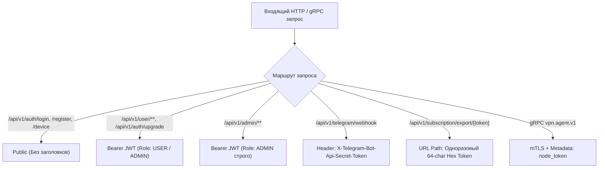

# Спецификация API: Общие соглашения и стандарты

Документация описывает все программные интерфейсы центрального сервера Aura VPN (`server/`): публичный REST API, защищенный клиентский API, панель управления администратора, вебхуки Telegram и бидирекциональный gRPC протокол управления нодами.

---

## 1. Базовые URL и сетевые эндпоинты

| Окружение | Базовый URL | Протокол / Порт | Назначение |
|---|---|---|---|
| **Production REST API** | `https://vpn.struchev.site/api/v1` | HTTPS (443) / Spring Boot (8080) | Клиентские запросы, веб-интерфейс, боты |
| **Local Development** | `http://localhost:8080/api/v1` | HTTP (8080) | Локальное тестирование и отладка |
| **Control Plane (gRPC)** | `dns:///vpn.struchev.site:9090` | mTLS gRPC (9090) | Управление парком VPN-нод (`agent/`) |
| **DNS-over-HTTPS (DoH)** | `https://1.1.1.1/dns-query` | DoH JSON API | Автономный резолв доменов API клиентами |

---

## 2. Спецификация аутентификации

В системе применяются 5 различных схем аутентификации:



### 2.1. Bearer JWT токен (`Authorization: Bearer <token>`)
* **Формат токена**: стандартный RFC 7519 JWT (JSON Web Token), подписанный алгоритмом HMAC-SHA256 (`HS256`).
* **Время жизни**: 30 суток с момента генерации (`2592000000 ms`).
* **Payload токена**:
  ```json
  {
    "sub": "42",
    "email": "user@example.com",
    "role": "USER",
    "iat": 1789150000,
    "exp": 1791742000
  }
  ```
* **Передача в запросах**: заголовок HTTP `Authorization: Bearer <token>`.

### 2.2. Единый ответ аутентификации (`AuthResponse`)
Все методы регистрации, входа, гостевого входа и SSO возвращают одинаковый DTO:

```json
{
  "token": "eyJhbGciOiJIUzI1NiJ9.eyJzdWIiOiI0MiIsImVtYWlsIjoidXNlckBleGFtcGxlLmNvbSIsInJvbGUiOiJVU0VSIiwiaWF0IjoxNzg5MTUwMDAwLCJleHAiOjE3OTE3NDIwMDB9...",
  "userId": 42,
  "email": "user@example.com",
  "role": "USER",
  "referralCode": "REF42ABC"
}
```

---

## 3. Критический финансовый инвариант: Микро-USDT (`micro-USDT`)

::: danger ФИНАНСОВЫЙ ИНВАРИАНТ
Все финансовые величины в API передаются и принимаются **строго в целочисленных микро-USDT** (`micro-USDT`).
Использование вещественных чисел (`float`, `double`) в запросах на списание или пополнение **запрещено**!
:::

* **Коэффициент перевода**: $1\text{ USDT} = 1\,000\,000\text{ micro-USDT}$.
* **Тип данных в коде и JSON**: целочисленный `Long` / `int64` (строка или число без дробной точки).
* **Примеры эквивалентов**:
  * `$1.00 USDT` $\rightarrow$ `1000000`
  * `$0.10 USDT` $\rightarrow$ `100000`
  * `$0.001 USDT` (шаг дельты инвойса) $\rightarrow$ `1000`
  * `$0.0004 USDT` (допуск совпадения) $\rightarrow$ `400`
  * `$10.00 USDT` (годовой тариф Basic) $\rightarrow$ `10000000`

---

## 4. Стандартные коды ошибок HTTP

| Код | Статус | Причина | Пример ответа |
|---|---|---|---|
| **200** | OK | Запрос выполнен успешно | `{"status": "SUCCESS"}` |
| **201** | Created | Ресурс создан | `{"status": "CREATED", "deviceId": 12}` |
| **400** | Bad Request | Ошибка валидации, недостаток средств, неверные параметры | `{"error": "INSUFFICIENT_BALANCE", "shortfallUsdtMicro": 500000}` |
| **401** | Unauthorized | Отсутствует, истёк или скомпрометирован JWT / Secret token | `{"error": "Unauthorized"}` |
| **403** | Forbidden | Недостаточно прав (попытка вызова `/admin` с ролью `USER` или аккаунт `BLOCKED`) | `{"error": "Forbidden"}` |
| **404** | Not Found | Ресурс не найден (устройство, нода, инвойс) | `{"error": "Not Found"}` |
| **409** | Conflict | Дубликат уникального поля (email уже зарегистрирован, txHash уже заклеймлен) | `{"error": "Email already in use"}` |
| **410** | Gone | Срок действия токена экспорта или инвойса истек | `{"error": "Subscription expired"}` |

---

## 5. Быстрый указатель методов API

```
├── /api/v1/auth
│   ├── POST /register               (Регистрация по email/паролю)
│   ├── POST /login                  (Аутентификация с авто-слиянием гостя)
│   ├── POST /upgrade                (Преобразование гостя в постоянный аккаунт)
│   ├── POST /device                 (1-click анонимная авторизация по Device UUID)
│   ├── POST /google                 (Вход через Google ID Token)
│   ├── POST /telegram               (Вход через Telegram Mini App initData)
│   ├── POST /web-handoff            (Выпуск одноразового SSO-кода для перехода в браузер)
│   └── POST /web-handoff/exchange   (Обмен SSO-кода на полноправный JWT)
│
├── /api/v1/user
│   ├── GET  /profile                (Данные профиля, баланс, подписка, реферальные ссылки)
│   ├── GET  /tariffs                (Актуальная тарифная сетка)
│   ├── GET  /regions                (Доступные серверные локации и нагрузка)
│   ├── GET  /subscription/links     (VLESS ссылки для родных клиентов)
│   ├── GET  /devices                (Список зарегистрированных устройств пользователя)
│   ├── POST /devices                (Регистрация нового устройства)
│   ├── POST /devices/{id}/touch     (Продление активности устройства при коннекте)
│   ├── DELETE /devices/{id}         (Отзыв устройства и удаление ключей с нод)
│   ├── POST /telegram-link          (Генерация deep-link для привязки Telegram-бота)
│   ├── GET  /invoices               (Журнал крипто-инвойсов пользователя)
│   ├── GET  /balance-history        (Полная бухгалтерская выписка движения средств)
│   ├── POST /billing/invoice        (Создание депозитного инвойса TRC-20 / EVM)
│   ├── POST /billing/purchase       (Оплата или продление подписки с баланса)
│   └── POST /billing/claim-tx       (Ручной клейм транзакции по блокчейн-хешу)
│
├── /api/v1/admin
│   ├── GET  /dashboard              (Операционные метрики, выручка, деградация ТСПУ)
│   ├── GET  /users                  (Список всех пользователей с подписками и рефералами)
│   ├── POST /users/{id}/balance     (Ручная финансовая корректировка баланса)
│   ├── POST /users/{id}/status      (Блокировка / активация пользователя)
│   ├── POST /users/{id}/subscription/extend (Продление подписки пользователя)
│   ├── GET  /nodes                  (Мониторинг нод, CPU, RAM, пинг, трафик, статус)
│   ├── POST /nodes/bootstrap-token  (Выпуск одноразового токена регистрации ноды)
│   ├── POST /nodes/{id}/pool        (Смена пула: trial, paid, quarantine)
│   ├── POST /nodes/{id}/status      (Принудительная смена статуса: ONLINE, OFFLINE)
│   ├── POST /nodes/{id}/sync        (Форсированная отправка ConfigSync на ноду)
│   ├── POST /nodes/{id}/command     (Отправка управляющей команды агенту ноды)
│   ├── GET  /policies               (Просмотр транспортных политик)
│   ├── POST /policies               (Обновление глобальной транспортной политики)
│   ├── POST /tasks/enforce-quotas   (Ручной запуск сборщика квот и протухших подписок)
│   └── POST /crypto/reconcile       (Ручная сверка и зачисление крипто-депозита)
│
├── /api/v1/subscription/export/{token} (Публичный экспорт для v2rayNG, Hiddify, Karing)
├── /api/v1/telegram/webhook            (Входящие апдейты Bot API и оплата Stars)
└── gRPC vpn.agent.v1.AgentStreamService (:9090 mTLS)
```
