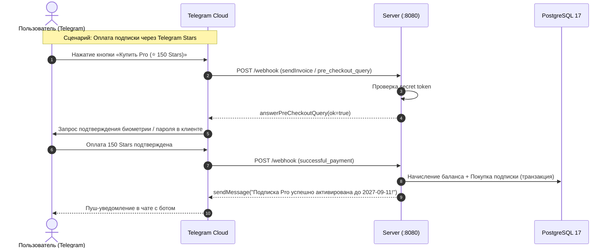

# Telegram Webhook API: Бот, Команды и Оплата Stars

Контроллеры: `TelegramBotController.java`, `TelegramBotService.java`.  
Базовый путь: `/api/v1/telegram/webhook`.

---

## 1. POST /api/v1/telegram/webhook

Принимает асинхронные обновления от серверов Telegram Bot API (сообщения пользователей, нажатия инлайн-кнопок, платежи Telegram Stars).

* **Метод / Путь**: `POST /api/v1/telegram/webhook`
* **Аутентификация**: <span class="api-badge api-auth-public">Header Secret Token</span>  
  Заголовок HTTP: `X-Telegram-Bot-Api-Secret-Token: <SECRET_TOKEN>` (валидируется со значением из конфигурации сервера `telegram.bot.secret-token`).
* **Content-Type**: `application/json`

::: warning БЕЗОПАСНОСТЬ ВЕБХУКА
Если заголовок `X-Telegram-Bot-Api-Secret-Token` отсутствует или не совпадает с секретом бота, сервер немедленно возвращает `401 Unauthorized` без парсинга тела запроса.
:::

---

## 2. Поддерживаемые сценарии и события



### 2.1. Обработка команд сообщения (`message`)

#### `/start [refCode]` (Регистрация или диплинк)
Если пользователь перешел по ссылке `https://t.me/MyVpnBot?start=REF42ABC`:
1. Сервер находит существующего пользователя по `telegram_id` или создает нового (`tg_<id>@telegram.local`).
2. Сохраняет связь с реферером (`referredByUserId = 42`).
3. Начисляет 3-дневный бесплатный тариф `trial` с отправкой приветственного сообщения и кнопки запуска Mini App.

#### `/start link_<code_token>` (Привязка к Web-аккаунту)
Если пользователь нажал «Привязать Telegram» в веб-интерфейсе:
1. Сервер валидирует связующий код из `POST /api/v1/user/telegram-link`.
2. Записывает `telegram_id` в профиль целевого пользователя.
3. Отправляет подтверждение: «Ваш Telegram-аккаунт успешно привязан к личному кабинету!».

### 2.2. Обработка платежей в Telegram Stars (`pre_checkout_query` & `successful_payment`)

1. **Pre-checkout валидация**:
   * Telegram отправляет `pre_checkout_query` с `currency: "XTR"`, суммой в звёздах и `invoice_payload`.
   * Сервер валидирует корректность тарифа и отвечает методом `answerPreCheckoutQuery(ok=true)`.
2. **Фиксация платежа**:
   * Telegram передаёт объект `successful_payment` с уникальным `telegram_payment_charge_id`.
   * Сервер атомарно начисляет микро-USDT эквивалент на баланс пользователя (1 Star $\approx 0.02$ USDT) и сразу продлевает подписку.

---

## 3. Схема входящего запроса (Update JSON)

```json
{
  "update_id": 987654321,
  "message": {
    "message_id": 412,
    "from": {
      "id": 12345678,
      "is_bot": false,
      "first_name": "Ivan",
      "username": "ivan_dev",
      "language_code": "ru"
    },
    "chat": {
      "id": 12345678,
      "type": "private"
    },
    "date": 1789152000,
    "text": "/start REF42ABC"
  }
}
```

### Пример успешного платежа Stars (`successful_payment`)

```json
{
  "update_id": 987654322,
  "message": {
    "message_id": 413,
    "from": {
      "id": 12345678,
      "first_name": "Ivan"
    },
    "chat": {
      "id": 12345678,
      "type": "private"
    },
    "date": 1789152050,
    "successful_payment": {
      "currency": "XTR",
      "total_amount": 150,
      "invoice_payload": "tariff_pro_annual_user_12",
      "telegram_payment_charge_id": "tg_charge_stars_881923"
    }
  }
}
```

### Ответ сервера (200 OK)

Сервер Telegram ожидает пустой `200 OK` или `{}`:

```json
{}
```

### Пример cURL для эмуляции апдейта

```bash
curl -X POST "https://vpn.struchev.site/api/v1/telegram/webhook" \
  -H "X-Telegram-Bot-Api-Secret-Token: your_configured_bot_secret_token" \
  -H "Content-Type: application/json" \
  -d '{
    "update_id": 10001,
    "message": {
      "message_id": 1,
      "from": { "id": 12345678, "first_name": "Test" },
      "chat": { "id": 12345678, "type": "private" },
      "text": "/start"
    }
  }'
```
