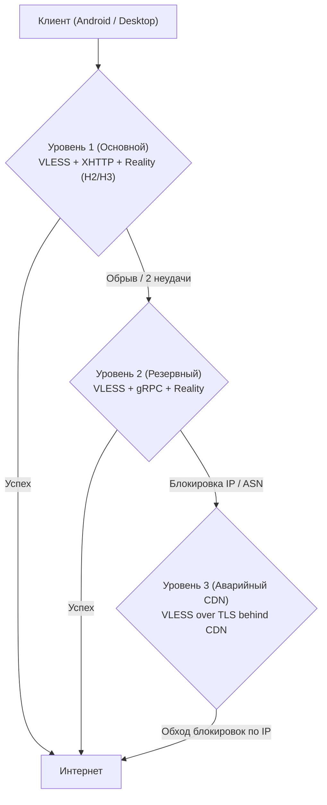

# Сетевой транспорт и противодействие ТСПУ / DPI

Aura VPN использует многоуровневую транспортную стратегию, разработанную на основе глубоких исследований поведения российских комплексов ТСПУ (Технические средства противодействия угрозам) и зарубежных систем DPI (Китай, Иран).

---

## 1. Многоуровневая транспортная стратегия (Transport Tiers)



### 1.1. Tier 1 (Основной): VLESS + XHTTP + Reality
* **Суть**: VLESS инкапсулируется в семантически корректный поток HTTP/2 (`POST /api/v1/stream`) либо HTTP/3 (QUIC) с маскировкой под легитимный иностранный ресурс (например, `dl.google.com`).
* **Почему XHTTP**: в отличие от TCP-сокетов, XHTTP дробит поток на стандартные HTTP/2 фреймы и мультиплексирует запросы. Поведение трафика неотличимо от скачивания обновлений или стриминга видео через CDN.
* **Порт**: `443/tcp` и `443/udp`.

### 1.2. Tier 2 (Резервный): VLESS + gRPC + Reality
* **Суть**: Инкапсуляция VLESS-фреймов в бинарный поток gRPC поверх HTTP/2.
* **Назначение**: Активируется, если локальный провайдер некорректно обрабатывает длинные POST-запросы XHTTP или применяет агрессивный rate limiting к H2 фреймам.
* **Порт**: `8443/tcp`.

### 1.3. Tier 3 (Аварийный CDN Fallback): VLESS over TLS behind Cloudflare/Gcore
* **Суть**: Клиент подключается к Anycast IP-адресам крупной сети доставки контента (CDN). CDN расшифровывает внешний TLS и проксирует запрос на внутренний сервер сервиса через веб-сокет или gRPC.
* **Назначение**: Полный обход блокировки по IP-адресу или всей автономной системе (ASN) хостинг-провайдера.

---

## 2. Почему TCP + Vision перестал работать в 2025–2026 гг.

Протокол VLESS с расширением TCP+Vision долгое время считался эталоном маскировки. Однако углубленный анализ показал причины его массовой деградации:

1. **Модель детекции трёх сигналов по «И» (AND-rule)**:
   ТСПУ на магистральных каналах активирует фильтрацию только при одновременном выполнении трех условий:
   $$\text{Block} = (\text{Зарубежная подсеть VPS}) \land (\text{Характерная TLS-энтропия JA3/JA4}) \land (\text{Параллельные сессии})$$
   Чистый TCP-поток под Reality имеет специфический профиль соотношения входящих и исходящих пакетов, вычисляемый эвристическими нейросетевыми классификаторами.

2. **Правило отсечки 16 Килобайт (16 KB Cutoff)**:
   При первых 16 КБ трафика ТСПУ пропускает поток для завершения TLS Handshake. Но как только по открытому TCP-соединению непрерывно прокачивается более 16 КБ шифрованных данных без стандартных пауз HTTP-запросов, оборудование вставляет `TCP RST` или сбрасывает соединение.

3. **Ловушка адаптивной блокировки (120s / 600s Blackholing)**:
   * При первом подозрении ТСПУ накладывает тихий блэкхол на целевой `IP:port` ровно на **120 секунд**.
   * Если клиент немедленно пытается переподключиться каждую секунду (агрессивный retry loop), ТСПУ классифицирует источник как автоматизированный бот и продлевает заморозку до **600 секунд (10 минут)** для всей подсети абонента.

---

## 3. Алгоритм Smart Reconnect Backoff

Чтобы клиенты Aura VPN не загоняли себя в 10-минутную ловушку ТСПУ, в Android и Desktop клиентах реализован алгоритм умной паузы:

```mermaid
flowchart TD
    Conn["Обрыв соединения / Таймаут"] --> Pause["Пауза тишины 15-20 секунд<br/>(Ожидание истечения таймера ТСПУ 120s)"]
    Pause --> Probe{"Проверочный probe-запрос<br/>к той же ноде"}
    Probe -->|Успех| Resume["Возобновление сессии"]
    Probe -->|Повторная ошибка (Count >= 2)| Hop["Переключение на резервную ноду<br/>в другом регионе / пуле"]
    Hop --> T2Try["Попытка Tier 2 (gRPC)"]
```

### Ключевые параметры алгоритма:
1. **Тишина перед повтором**: при обнаружении RST-пакета клиент выдерживает экспоненциальную паузу от 15 до 20 секунд перед первой попыткой реконнекта.
2. **Лимит попыток на узел**: смена IP-адреса ноды происходит строго после 2–3 неудач, предотвращая «засветку» всех рабочих нод пула перед DPI в течение пары секунд.
3. **Рандомизация TLS ClientHello**: рандомизация порядка расширений TLS и подборка актуальных браузерных фингерпринтов (`chrome_120`, `firefox_130`, `safari_17`).

---

## 4. Зондирование «Белых списков» (Whitelist Probing)

В моменты проведения региональных учений или введения режима ЧС магистральные операторы переводят оборудование в режим «Белого списка» (Default Deny), пропуская только трафик к аккредитованным отечественным сервисам (Госуслуги, VK, банки).

Клиент Aura VPN периодически выполняет проверку:
1. Запрос к контрольному белому ресурсу (`https://gosuslugi.ru/favicon.ico`).
2. Если контрольный ресурс открывается мгновенно, а зарубежный трафик полностью заблокирован, клиент сообщает пользователю о включении режима белых списков и автоматически активирует Tier 3 CDN-туннель с маскировкой SNI.

---

## 5. Защита от DNS Poisoning: DNS-over-HTTPS (DoH)

Для предотвращения перехвата и подделки DNS-ответов провайдерскими резолверами, все клиенты сервиса используют встроенный клиент **DNS-over-HTTPS**:
* Запросы отправляются в зашифрованном виде напрямую на независимые резолверы: Cloudflare (`https://1.1.1.1/dns-query`) и Quad9 (`https://dns.quad9.net/dns-query`).
* Домен сервера управления `vpn.struchev.site` резолвится независимо от системных настроек ОС.
