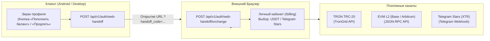

# Биллинг, Блокчейн и Платежная Архитектура

Сервисы: `BillingService.java`, `BlockchainPaymentService.java`, `BlockchainScannerTask.java`.  
Модель баланса: Депозитный счет в целочисленных микро-USDT (`micro-USDT`).

---

## 1. Архитектура платежей без нарушения правил магазинов

Google Play и Apple App Store запрещают продавать подписки внутри мобильного приложения в обход внутренней платежной системы (In-App Purchases). В то же время карты российских банков в Google Play не принимаются.

Архитектурное решение Aura VPN:
1. **В мобильных и десктопных клиентах нет экранов оплаты**: приложения содержат только форму логина и профиль.
2. Для пополнения счета приложение генерирует одноразовый handoff-код и открывает системный браузер пользователя:
   `https://vpn.struchev.site/?handoff_code=...&next=/billing`
3. Либо пользователь производит оплату напрямую в Telegram-боте через **Telegram Stars**.
4. Схема полностью легальна и соответствует правилам Google Play (приложение является чистым клиентом сервиса).

---

## 2. Алгоритм идентификации депозита (Random Micro-Tolerance)

Для приема криптовалюты на единый системный кошелек без развертывания дорогостоящих индивидуальных смарт-контрактов для каждого пользователя используется алгоритм динамического микро-хвоста:

$$\text{ExpectedAmount} = \text{BaseAmount} + k \cdot \Delta_{\text{step}}$$

### Параметры алгоритма:
* $\Delta_{\text{step}} = 1\,000\text{ micro-USDT}$ ($0.001$ USDT).
* $k \in [1, 999]$ — уникальный случайный множитель, генерируемый для каждого активного инвойса.
* Окно совпадения (Tolerance Window): $\pm 400\text{ micro-USDT}$ ($\pm 0.0004$ USDT).

### Исключение коллизий:
Поскольку шаг $\Delta_{\text{step}} = 1\,000$, а допуск составляет всего $\pm 400$, интервалы допустимых сумм двух разных инвойсов:
$$[A + k_1 \cdot 1000 - 400, A + k_1 \cdot 1000 + 400] \quad \text{и} \quad [A + k_2 \cdot 1000 - 400, A + k_2 \cdot 1000 + 400]$$
при $k_1 \neq k_2$ **никогда не пересекаются**. Это обеспечивает 100% однозначность идентификации плательщика даже при сотнях одновременных платежей.

---

## 3. Фоновый сканер блокчейна (`BlockchainScannerTask`)

Фоновый процесс Spring запускается каждые 30 секунд:
1. Запрашивает последние входящие переводы TRC-20 USDT через TronGrid REST API.
2. Запрашивает последние события `Transfer(address,address,uint256)` контрактов USDT в сетях Arbitrum, Base, Ethereum через JSON-RPC.
3. Фильтрует транзакции, сопоставляя полученную сумму с диапазоном `[tolerance_min_micro, tolerance_max_micro]` активных инвойсов.
4. При совпадении атомарно переводит инвойс в статус `PAID`, записывает `tx_hash` и зачисляет средства на баланс пользователя через `PESSIMISTIC_WRITE` блокировку.

---

## 4. Реферальная программа и финансовые начисления

В систему встроен двусторонний реферальный механизм для вирального роста:
* **Реферер**: получает **15%** от каждой оплаты подписки приглашенным пользователем на свой баланс в микро-USDT.
* **Приглашенный (Реферал)**: получает **10% скидку** на первую покупку или стартовый бонус на баланс.
* Все начисления фиксируются в реестре `balance_entries` с типом `REFERRAL_BONUS` и прозрачно отображаются в профиле.
