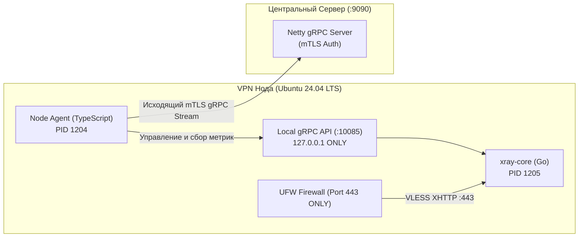

# Управление нодами и оркестрация (Control Plane)

Модуль: `server/src/main/java/com/vpn/server/grpc/`, `agent/src/`.

Оркестрация парка серверов NextGen VPN построена по схеме **обратного управления (Inverted Control Plane)**: центральный сервер никогда не инициирует сетевые соединения к нодам. Напротив, нодовый агент сам подключается к бэкенду.

---

## 1. Концепция Zero Inbound Ports

Традиционные VPN-панели (Outline, 3X-UI, Marzban) открывают на сервере веб-панель управления или порт SSH, что делает их легкой мишенью для автоматических сканеров Shodan/Censys и систем цензуры.

В NextGen VPN:
1. Нода настраивается скриптом `scripts/install-node.sh`.
2. Firewall (UFW / iptables) блокирует **все входящие подключения**, кроме единственного публичного VPN-порта `443` (VLESS XHTTP/Reality).
3. Агент ноды (`agent/src/index.ts`) запускается в качестве системной службы `systemd` и держит постоянный исходящий канал к серверу.



---

## 2. Процесс развертывания ноды (Bootstrap Registration)

1. Администратор генерирует одноразовый bootstrap-токен через админ-панель или API:
   `POST /api/v1/admin/nodes/bootstrap-token?pool=paid`
2. На чистом VPS запускается команда установки:
   ```bash
   curl -sSL https://vpn.struchev.site/install-node.sh | sudo bash -s -- \
     --server vpn.struchev.site:9090 \
     --token bst_9f14b620e79148d98d844c8032c1fa01 \
     --region nl-ams
   ```
3. Скрипт скачивает бинарник `xray-core`, устанавливает Node.js и запускает агент.
4. Агент вызывает метод `RegisterNode`:
   * Передаёт `bootstrap_token`, hostname, public IP, регион.
   * Сервер валидирует токен, сохраняет ноду в БД и возвращает постоянный `node_token`.
   * Агент записывает `node_token` в локальный защищенный файл `.agent-state.json` (chmod 600).
5. Агент открывает постоянный двунаправленный стрим `SyncStream`.

---

## 3. Пулы нод (Node Pools)

Для обеспечения качества обслуживания и защиты платящих пользователей все ноды разделены на изолированные пулы:

| Пул нод | Назначение | Доступ | Характеристики |
|---|---|---|---|
| **`paid`** | Основной коммерческий пул | Пользователи тарифов `basic` и `pro` | Премиальные каналы 1–10 Gbps, гарантированная полоса, автоматическая балансировка |
| **`trial`** | Пробный бесплатный пул | Пользователи тарифа `trial` | Ограничение полосы на пользователя, изоляция от платных узлов |
| **`quarantine`** | Карантинный пул | Исключён из выдачи клиентам | Ноды, на которых зафиксирован всплеск RST-пакетов ТСПУ или аппаратные сбои |

---

## 4. Алгоритм динамического скоринга нагрузки V7 (`NodeScoringService`)

При запросе списка доступных нод клиентом сервер ранжирует ноды по формуле комплексной оценки качества V7:

$$\text{Score} = w_{\text{cpu}} \cdot (100 - \text{CPU}\%) + w_{\text{ram}} \cdot (100 - \text{RAM}\%) + w_{\text{conns}} \cdot S(\text{Conns}) + w_{\text{egress}} \cdot S(\text{Bps}) - \text{Penalty}_{\text{fail}}$$

### Весовые коэффициенты:
* $w_{\text{cpu}} = 0.25$: штраф за высокую утилизацию ядер процессора;
* $w_{\text{ram}} = 0.15$: штраф за дефицит оперативной памяти;
* $w_{\text{conns}} = 0.30$: равномерное распределение количества одновременных сокетов;
* $w_{\text{egress}} = 0.30$: учет доступной пропускной способности сетевого интерфейса;
* $\text{Penalty}_{\text{fail}}$: штрафной балл при наличии сообщений об ошибках в течение последних 5 минут.

Клиент всегда получает ссылки на ноды с наивысшим баллом здоровья, что гарантирует мгновенное подключение и минимальный пинг.

---

## 5. Автоматический карантин (Auto-Quarantine)

Фоновый процесс бэкенда анализирует телеметрию с нод в реальном времени:
1. Если процент неудачных рукопожатий на ноде превышает **25%** за 5-минутное окно;
2. Либо агент ноды фиксирует массовые ответы `TCP RST` на границе 16 КБ;
3. Сервер автоматически переводит узел из пула `paid` в пул `quarantine`.
4. Клиенты мгновенно перенаправляются на здоровые серверы без необходимости ручного вмешательства дежурного инженера.
