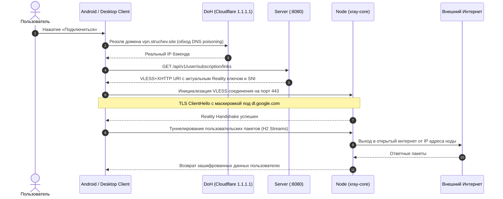

# Архитектура Aura VPN: Обзор и концепция

Aura VPN — это высокоустойчивый к цензуре VPN-сервис нового поколения, спроектированный с учётом реалий продвинутых систем глубокого анализа пакетов (ТСПУ / DPI) образца 2025–2026 годов.

---

## 1. Фундаментальные принципы системы

1. **Антицензура во главе угла**:
   * Любое архитектурное решение проверяется на устойчивость к ТСПУ/DPI.
   * Устаревшие протоколы (OpenVPN, WireGuard, ShadowSocks, чистый VLESS+TCP+Vision) признаны непригодными для РФ, Ирана и Китая.
   * Основной стек: **VLESS + XHTTP (H2/H3) + Reality**. Резервный стек: **VLESS + gRPC + Reality**. Аварийный fallback: **VLESS over TLS behind CDN** (Cloudflare/Gcore).

2. **Zero-Logs (Принцип нулевого логирования)**:
   * Ноды **не ведут журнал посещений** (`access.log = "/dev/null"`).
   * В БД сервера **нет истории сетевой активности, посещенных URL или DNS-запросов**.
   * Фиксируются только агрегированные счетчики объема переданных байт за биллинговый период (для контроля квоты тарифа).

3. **Zero Inbound Ports на узлах**:
   * VPN-ноды не открывают входящих портов управления (SSH наружу закрыт, gRPC наружу закрыт).
   * Агент ноды (`agent/`) сам устанавливает исходящее mTLS gRPC соединение к центральному серверу (`server:9090`).

4. **Целочисленный финансовый учет**:
   * Все денежные транзакции производятся строго в **микро-USDT** ($1\text{ USDT} = 1\,000\,000\text{ micro-USDT}$, тип `Long` / `int64`).
   * Плавающие типы (`float`, `double`) исключены из кода биллинга во избежание ошибок округления IEEE 754.

5. **Изоляция ключей на тройку сущностей**:
   * Ключ доступа VLESS UUID выдается не просто пользователю, а на тройку `(device, user, node)`.
   * Компрометация ключа на одном устройстве не требует отзыва подписки на других устройствах.

---

## 2. Структура монорепозитория

Проект организован в виде единого монорепозитория, включающего сервер, нодовый агент, клиентские приложения и общий протокол:

```
vpn/
├── proto/                         # Единый Protobuf v3 контракт
│   └── vpn/agent/v1/agent.proto   # gRPC контракты взаимодействия Server <-> Agent
│
├── server/                        # Центральный control plane (Spring Boot 4.1, Java 25)
│   ├── src/main/java/             # Контроллеры, сервисы, JPA сущности, gRPC сервер
│   └── src/main/resources/db/     # 7 миграций Flyway (PostgreSQL 17)
│
├── agent/                         # Демон ноды (TypeScript, Node.js 22, xray-core)
│   ├── src/                       # gRPC клиент, управление дочерним xray, метрики хоста
│   └── scripts/install-node.sh    # Автоматический bootstrap ноды из Ubuntu 24.04 LTS
│
├── android/                       # Нативное мобильное приложение (Android SDK 35)
│   ├── app/src/main/java/         # Material 3 UI, VpnService, libXray AAR wrapper
│   └── app/libs/libXray.aar       # Бинарный движок xray-core под arm64-v8a/armeabi/x86_64
│
├── desktop/                       # Кроссплатформенный десктопный клиент
│   ├── src/main/                  # Electron main process (system proxy networksetup)
│   └── src/renderer/              # React 18 + TypeScript + Vite UI
│
├── web/                           # Веб-приложение и Telegram Mini App
│   ├── src/                       # React 18 + Tailwind CSS + Lucide Icons + PrimeReact
│   └── src/admin/                 # Полнофункциональная консоль администратора (/admin)
│
├── e2e/                           # End-to-End интеграционные тесты (Playwright)
└── docs/                          # Исходные технические и правовые исследования
```

---

## 3. Матрица технологического стека

| Подсистема | Технологии | Роль и обоснование |
|---|---|---|
| **Server** | Spring Boot 4.1, Java 25, Gradle (Groovy DSL) | Высокопроизводительный асинхронный бэкенд, строгая типизация, gRPC Netty server |
| **Database** | PostgreSQL 17, Flyway 10, Spring Data JPA | Реляционная целостность, финансовые блокировки `PESSIMISTIC_WRITE`, версионирование схемы |
| **Node Daemon** | TypeScript, Node.js 22, `@grpc/grpc-js` | Легковесный менеджер жизненного цикла `xray-core` с малым потреблением RAM (< 60 MB) |
| **VPN Engine** | xray-core v24+ (Go), libXray.aar | Единственный движок с полноценной реализацией XHTTP, Reality и динамического API клиентов |
| **Android** | Java 17, Android SDK 35, AndroidX Credential Manager | Material Design 3, foreground VpnService с вызовом `protect()` от петель маршрутизации |
| **Desktop** | Electron 34, React 18, Vite | Управление системным HTTP/SOCKS5 прокси без необходимости прав администратора root/admin |
| **Web SPA** | React 18, Vite, Tailwind CSS, Lucide | Единый адаптивный SPA для браузера, мобильных устройств и Telegram Mini App |
| **E2E Testing**| Playwright, Node.js | Автоматизированные тесты пользовательских сценариев (регистрация, покупка, вход) |

---

## 4. Жизненный цикл трафика пользователя


