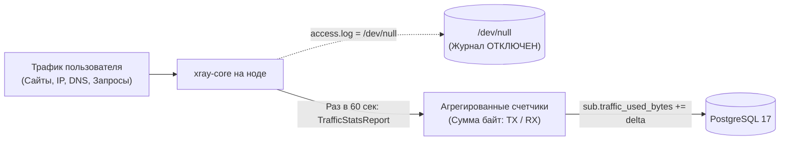

# Безопасность и Модель Данных (PostgreSQL 17)

Конфигурация схемы: `server/src/main/resources/db/migration/`.  
База данных: PostgreSQL 17 с версионированием через Flyway (7 миграций).

---

## 1. Архитектурный инвариант: Zero-Logs

NextGen VPN гарантирует приватность пользователей на системном и аппаратном уровне:

* **На серверах VPN (нодах)**:
  * В конфигурационном файле `xray-config.json` параметр `log.access` строго указывает на `/dev/null`.
  * Лог ошибок `log.error` пишется с уровнем `warning` и содержит только системные сбои сокетов без фиксации целевых IP-адресов.
* **В базе данных (PostgreSQL)**:
  * Отсутствуют таблицы истории посещений, логов DNS или сессий соединения.
  * Единственные сохраняемые числовые показатели — это совокупный объем переданных байт (`traffic_used_bytes`) для контроля тарифной квоты.
  * Телеметрия сбоев ТСПУ сохраняет только хеш клиентского IP (`SHA-256(ip + salt)`) для предотвращения деанонимизации.

---

## 2. Изоляция ключей доступа: Тройка (Device, User, Node)

В отличие от устаревших сервисов, где один общий VLESS UUID выдается пользователю на все случаи жизни, в NextGen VPN генерация ключей изолирована:

1. Каждому зарегистрированному устройству пользователя присваивается собственный идентификатор `Device`.
2. При формировании конфигураций нод генерируется детерминированный или уникальный UUID на комбинацию `(device_id, user_id, node_id)`.
3. **Преимущество безопасности**:
   * Если пользователь потерял телефон или токен был скомпрометирован, отзыв устройства (`DELETE /api/v1/user/devices/{id}`) моментально инвалидирует только данный ключ.
   * Конфигурации на ноутбуке и планшете продолжают работать без перерыва.

---

## 3. Реестр миграций базы данных Flyway (V1 – V7)

Схема базы данных построена на 7 последовательных Flyway-миграциях:

### V1__init_schema.sql (Базовые сущности)
* `users`: `id`, `email`, `password_hash`, `role` (`USER`/`ADMIN`), `status` (`ACTIVE`/`BLOCKED`), `created_at`.
* `devices`: `id`, `user_id`, `device_name`, `platform`, `device_uuid`, `last_seen_at`.
* `tariffs`: `id` (`trial`, `basic`, `pro`), `price_monthly_micro`, `price_annual_micro`, `traffic_limit_bytes`, `max_devices`.
* `subscriptions`: `id`, `user_id`, `tariff_id`, `current_period_start`, `current_period_end`, `traffic_used_bytes`, `auto_renew`.
* `nodes`: `id`, `hostname`, `public_ip`, `region`, `status`, `node_token`.

### V2__billing_crypto.sql (Криптовалютный биллинг)
* `crypto_invoices`: `id`, `user_id`, `chain`, `recipient_address`, `base_amount_micro`, `expected_amount_micro`, `tolerance_min_micro`, `tolerance_max_micro`, `status`, `tx_hash`, `expires_at`.
* `balance_entries`: `id`, `user_id`, `amount_micro`, `balance_after_micro`, `type` (`DEPOSIT`, `SUBSCRIPTION_PAYMENT`, `REFERRAL_BONUS`, `MANUAL_ADJUSTMENT`), `reference_id`.

### V3__telemetry.sql (Диагностика ТСПУ и метрики нод)
* `node_metrics`: `id`, `node_id`, `cpu_percent`, `memory_used_bytes`, `active_connections`, `egress_bps`, `recorded_at`.
* `conn_telemetry`: `id`, `operator`, `region`, `transport`, `success`, `failure_reason`, `connect_time_ms`, `recorded_at`.

### V4__web_handoff.sql (Безопасный SSO переход)
* `web_handoff_tokens`: `id`, `user_id`, `code`, `expires_at`, `used`.

### V5__anti_enumeration.sql (Защита от перебора)
* `subscription_export_tokens`: `id`, `user_id`, `export_token`, `last_rotated_at`.
* `export_rate_limits`: `id`, `export_token`, `ip_address`, `requested_at`.

### V6__referral_program.sql (Реферальная программа)
* Добавление полей `referral_code` (unique) и `referred_by_user_id` (FK) в `users`.
* `referral_bonuses`: начисление 15% за покупку подписки приглашенным другом.

### V7__node_scoring_and_pools.sql (Оркестрация и пулы)
* Добавление полей `pool` (`paid`, `trial`, `quarantine`), `type` (`direct`, `cdn`), `asn`, `scoring_weight` в таблицу `nodes`.
