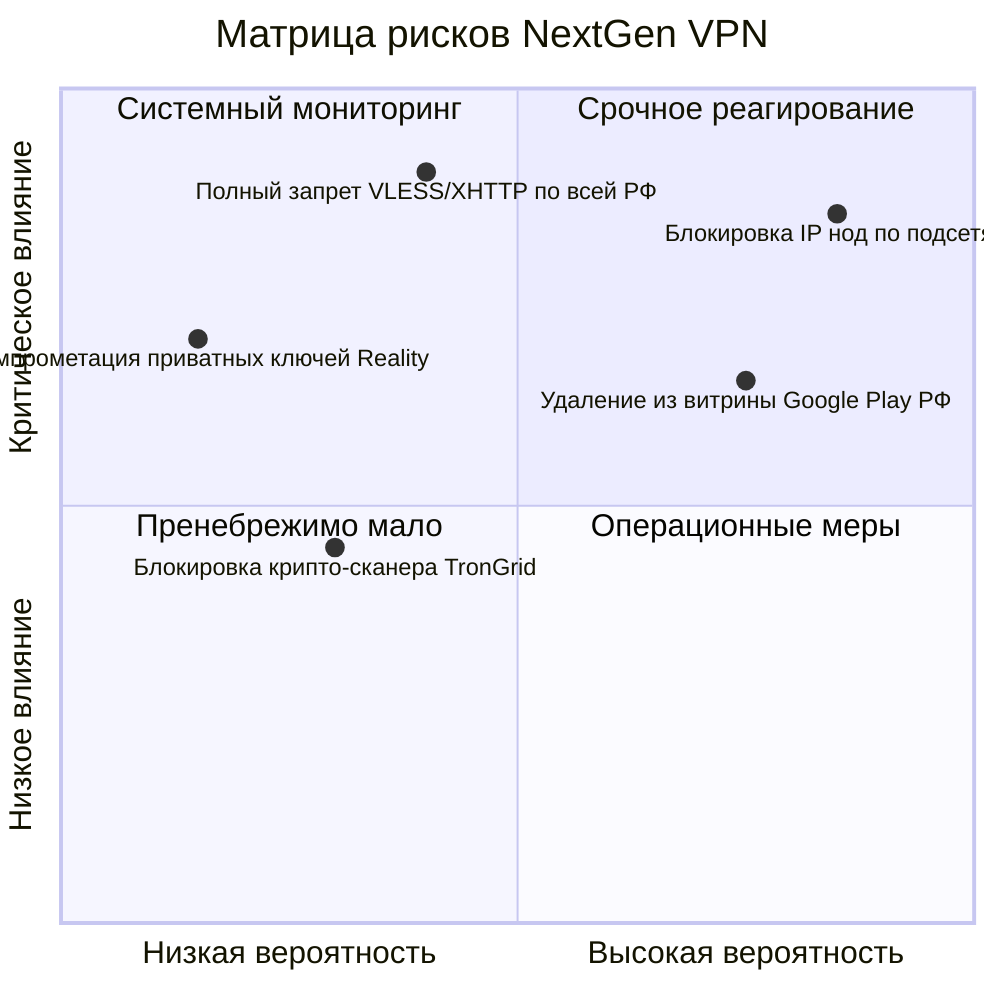

# Юнит-Экономика, Тарифы и Матрица Рисков

Анализ финансовой устойчивости сервиса, себестоимости инфраструктуры и операционных рисков.

---

## 1. Тарифная сетка

| Параметр | Пробный (`trial`) | Basic (`basic`) | Pro (`pro`) |
|---|---|---|---|
| **Стоимость / месяц** | Бесплатно (0 USDT) | **$1.00 USDT** (`1000000 micro`) | **$2.00 USDT** (`2000000 micro`) |
| **Стоимость / год** | — | **$10.00 USDT** (скидка ~17%) | **$20.00 USDT** (скидка ~17%) |
| **Срок действия** | 3 дня | 30 дней / 365 дней | 30 дней / 365 дней |
| **Лимит трафика** | 1 ГБ | 20 ГБ / месяц | 100 ГБ / месяц |
| **Максимум устройств** | 1 устройство | 2 устройства | 5 устройств |
| **Доступные пулы нод**| Пул `trial` | Пул `paid` | Пул `paid` (приоритетный скоринг) |

---

## 2. Юнит-экономика и себестоимость инфраструктуры

### 2.1. Расчёт стоимости ноды
* **Серверная конфигурация VPS**: 2–4 vCPU, 4–8 GB RAM, порт 1 Gbps с безлимитным трафиком (хостинг в Нидерландах / Германии / Финляндии).
* **Стоимость аренды узла**: $\approx €4.00 – €5.00$ в месяц ($\approx \$4.50 – \$5.50$).
* **Ёмкость одного узла**:
  * Среднее одновременное потребление пользователя в пике: $1.5 – 2.5\text{ Mbps}$.
  * Коэффициент одновременности (Concurrency Factor): $10 – 15\%$.
  * Ёмкость одной ноды с портом 1 Gbps: **от 150 до 250 активных подписчиков**.

### 2.2. Финансовые показатели на 1 000 подписчиков (структура 70% Basic / 30% Pro)
* **Месячная выручка (MRR)**:
  $$700 \times \$1.00 + 300 \times \$2.00 = \$1\,300\text{ / месяц}$$
* **Затраты на инфраструктуру**:
  * 5 рабочих нод пула `paid` ($\approx \$25$);
  * 1 нода пула `trial` ($\approx \$5$);
  * Центральный сервер управления (Spring Boot + PostgreSQL): $\approx \$20$;
  * Итого затраты: $\approx \$50\text{ / месяц}$.
* **Расходы на реферальную программу (15%)**: $\approx \$195$.
* **Валовая маржинальность (Gross Margin)**:
  $$\text{Margin} = \frac{\$1\,300 - \$50 - \$195}{\$1\,300} \approx \mathbf{81\%}$$

---

## 3. Матрица рисков и стратегии нейтрализации

| Риск | Вероятность | Влияние | Стратегия нейтрализации |
|---|:---:|:---:|---|
| **Блокировка IP-адресов нод ТСПУ** | Высокая | Высокая | Автоматический перевод в `quarantine`, динамический ввод новых серверов через bootstrap-скрипт, Tier 3 CDN fallback. |
| **Удаление из российского Google Play** | Высокая | Средняя | Распространение APK напрямую с сайта, Telegram-бот, Web-кабинет, независимое автообновление клиентов. |
| **Тотальный блэклист зарубежных подсетей** | Средняя | Критическая | Развертывание проксирующих шлюзов в нейтральных юрисдикциях (Казахстан, Армения, Турция), использование белых SNI. |
| **Комиссии блокчейна (Gas Spikes)** | Средняя | Низкая | Приоритетное предложение L2 сетей (Arbitrum, Base), где комиссия составляет менее $0.02. |
