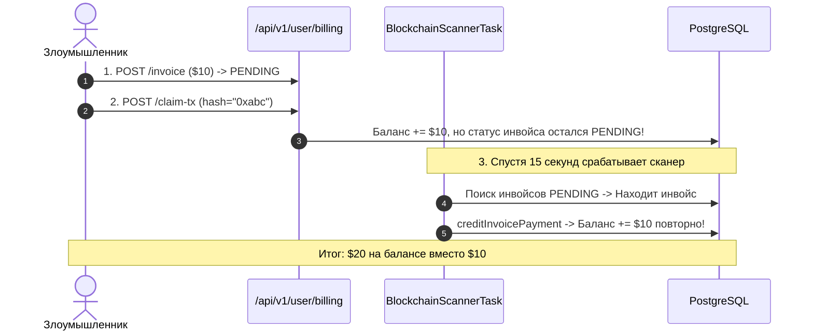

# Отчёт Технического Аудита: Баги, Уязвимости и Замечания

Дата проведения аудита: Сентябрь 2026.  
Объекты сканирования: `server/`, `agent/`, `android/`, `desktop/`, `web/`, `proto/`.

---

## 1. Сводный реестр выявленных дефектов

| № | Уровень | Проблема | Локализация | Статус |
|---|:---:|---|---|:---:|
| **1.1** | 🔴 Критический | Двойное зачисление депозита (Double-Crediting / Double-Spend) | `BillingService.java:133`, `claimTransaction:286` | ⚠️ Требует фикса |
| **1.2** | 🟡 Средний | Асимметрия срока действия триала (30 дней vs 3 дня) | `BillingService.java:269-276` | ⚠️ Требует фикса |
| **1.3** | 🟡 Средний | Отсутствие механизма автосписания продления подписки | `QuotaEnforcementTask.java:70` | ⚠️ Требует фикса |
| **2.1** | 🟠 Высокий | Выпуск активных JWT заблокированным пользователям через Handoff | `WebHandoffController.java:87` | ⚠️ Требует фикса |
| **2.2** | 🟡 Средний | Валидность ранее выпущенных JWT при блокировке аккаунта | `JwtAuthFilter.java:32-45` | Рекомендация |
| **2.3** | 🟡 Средний | Доступность экспорта VLESS-ссылок заблокированным пользователям | `SubscriptionExportService.java:275` | ⚠️ Требует фикса |
| **3.1** | 🟡 Средний | Необработанные `NullPointerException` (HTTP 500) без `@ControllerAdvice` | `UserController.java:246`, `AdminController.java:174` | ⚠️ Требует фикса |
| **4.1** | 🟢 UX | Отображение синтетического email `device_<uuid>@device.local` в профиле | `ProfilePage.tsx`, `ProfileFragment.java` | Замечание |
| **4.2** | 🟢 Архитектура| In-memory хранилище handoff-кодов в `ConcurrentHashMap` | `WebHandoffService.java:30` | Замечание |
| **4.3** | 🟢 UX | Несоответствие блокчейн-сетей между пользователем и админкой | `DashboardView.tsx`, `PaymentsSection.tsx` | Замечание |
| **4.4** | 🟢 Релиз | Дефолтный плейсхолдер Google Web Client ID в Android | `res/values/strings.xml:13` | Чеклист релиза |

---

## 2. Разбор критических проблем безопасности

### 2.1. Критическая уязвимость: Двойное зачисление крипто-депозита (Double-Spend)
* **Класс опасности**: Финансовая уязвимость высокой степени критичности.
* **Механика воспроизведения**:
  1. Пользователь создает инвойс на пополнение (`POST /api/v1/user/billing/invoice`), запись сохраняется со статусом `PENDING`.
  2. Переводит USDT в блокчейне.
  3. Не дожидаясь срабатывания сканера, нажимает «Я оплатил, вот хеш» (`POST /api/v1/user/billing/claim-tx`).
  4. Метод `claimTransaction` проверяет, что хеш ранее не использовался, и начисляет баланс. **При этом статус инвойса в таблице `crypto_invoices` НЕ меняется на `PAID` и остаётся `PENDING`!**
  5. Спустя 15 секунд срабатывает фоновый `BlockchainScannerTask`. Сканер находит в БД исходный инвойс со статусом `PENDING`, вызывает `creditInvoicePayment` и **повторно начисляет баланс** на ту же сумму.
* **Решение**:
  В `claimTransaction` атомарно переводить инвойс в статус `PAID` с фиксацией `tx_hash`. В `creditInvoicePayment` проверять `balanceEntryRepository.existsByReferenceId(txHash)`.



---

### 2.2. Выпуск JWT заблокированным аккаунтам через Web Handoff
* В базовых контроллерах статус пользователя строго проверяется:
  ```java
  if (!"ACTIVE".equals(user.getStatus())) {
      throw new IllegalStateException("User account is " + user.getStatus());
  }
  ```
* Однако в `WebHandoffController.exchangeHandoff` проверка статуса пользователя отсутствовала. Заблокированный администраторской блокировкой пользователь при переходе по ссылке handoff получал полноценный рабочий JWT-токен на 30 дней.
* **Решение**: добавить валидацию статуса в метод обмена кода.

---

### 2.3. Падения контроллеров с HTTP 500 из-за отсутствия `@ControllerAdvice`
* В контроллерах `UserController.java` и `AdminController.java` аргументы извлекались из сырых `Map<String, Object>` вызовами `Long.valueOf(req.get("amountMicro").toString())`.
* При отсутствии ключа в JSON происходил неперехваченный `NullPointerException`. Из-за отсутствия глобального перехватчика `@ControllerAdvice` клиент получал пустой generic HTTP 500.
* **Решение**: внедрить класс `GlobalExceptionHandler` с обработкой `ResponseStatusException`, `IllegalArgumentException` и возвратом JSON `{"error": "..."}` с кодом 400.
