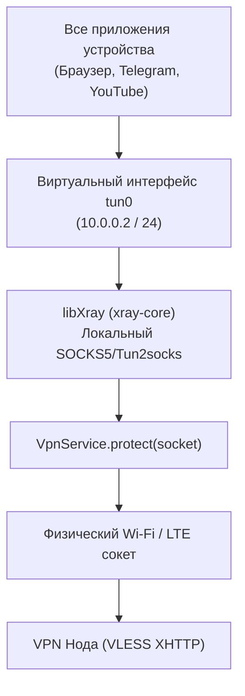

# Android Client (Material 3 + libXray)

Исходный код: `android/app/src/main/java/com/vpn/android/`.  
Целевая платформа: Android 8.0+ (API level 26..35).

---

## 1. Архитектура и стек компонентов

* **Пользовательский интерфейс**: Google Material Design 3 (Material You с динамической темой под цвет обоев устройства).
* **Сетевой движок**: Нативная библиотека `libXray.aar` (`XTLS/libXray`), компилируемая под архитектуры `arm64-v8a`, `armeabi-v7a`, `x86_64`.
* **Аутентификация**:
  * 1-Click анонимный вход по UUID устройства через `DeviceAuthService`;
  * Вход через Google Sign-In с использованием современного `androidx.credentials:credentials` (Google Credential Manager);
  * Вход по логину и паролю.
* **Безопасное хранение**: `EncryptedSharedPreferences` с аппаратным шифрованием ключей через Android Keystore.

---

## 2. Реализация системного туннеля (`VpnService`)

Класс: `com.vpn.android.vpn.NextGenVpnService`.

Android предоставляет абстракцию `android.net.VpnService` для перехвата исходящих IP-пакетов на уровне сетевого стека ядра Linux:



### Защита от бесконечной маршрутной петли (`protect()`)
Критически важно, чтобы сокеты, по которым сам клиент связывается с сервером управления API и передаёт зашифрованные VLESS-пакеты на ноду, **не попадали** обратно в интерфейс `tun0`.
Для этого в коде сервиса вызывается нативный метод:
```java
// Защита сокета xray-core от попадания в собственный VPN-интерфейс
boolean protectedOk = protect(socketFileDescriptor);
```

---

## 3. Разрешения манифеста (`AndroidManifest.xml`)

Приложение запрашивает минимально необходимый набор системных разрешений, полностью удовлетворяющий требованиям Google Play Data Safety:

| Разрешение | Тип | Назначение |
|---|---|---|
| `android.permission.INTERNET` | Обычное | Доступ к сети для REST API и исходящего VLESS туннеля |
| `android.permission.ACCESS_NETWORK_STATE` | Обычное | Отслеживание переключения между Wi-Fi и мобильной сетью |
| `android.permission.BIND_VPN_SERVICE` | Системное (Подпись) | Создание виртуального сетевого интерфейса VPN |
| `android.permission.FOREGROUND_SERVICE` | Обычное | Непрерывная работа VPN-туннеля в фоне без засыпания ОС |
| `android.permission.POST_NOTIFICATIONS` | Runtime (API 33+) | Отображение постоянного уведомления о статусе туннеля |

::: tip ЧИСТОТА МАНИФЕСТА
В приложении отсутствуют разрешения на чтение контактов, SMS, географическое местоположение, камеру или микрофон. Это гарантирует прохождение модерации в Google Play без дополнительных проверок безопасности.
:::
