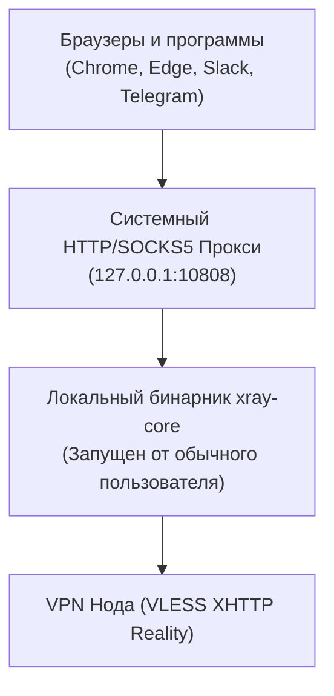

# Desktop Client (Electron + System Proxy)

Исходный код: `desktop/src/main/` (Electron Main) и `desktop/src/renderer/` (React UI).  
Поддерживаемые ОС: macOS (Apple Silicon / Intel), Windows 10/11 (x64), Linux (Debian, Ubuntu, Fedora).

---

## 1. Архитектурный выбор: Системный прокси вместо TUN-драйвера

В отличие от мобильных платформ, создание виртуального сетевого адаптера на десктопных ОС требует привилегий суперпользователя (`root` на macOS/Linux, `Administrator` на Windows) и установки сторонних драйверов ядра (Wintun, macOS Network Extensions).

Desktop-клиент NextGen VPN реализует надежную альтернативу: **управление системным прокси на уровне ОС**:



### Преимущества подхода:
1. **Не требуются права администратора**: приложение устанавливается и запускается в пространстве обычного пользователя.
2. **Отсутствие конфликтов драйверов**: нет риска синего экрана смерти (BSOD) из-за несовместимости сетевых драйверов Windows.
3. **Мгновенное переключение**: прокси включается и выключается нативными командами ОС за 50 миллисекунд.

---

## 2. Интеграция с операционными системами

Класс `desktop/src/main/proxy-manager.ts` инкапсулирует вызовы нативных утилит:

### 2.1. macOS
Использует системную утилиту `networksetup` для активного сетевого интерфейса (Wi-Fi или Ethernet):
```bash
# Включение SOCKS5 прокси
networksetup -setsocksfirewallproxy "Wi-Fi" 127.0.0.1 10808
networksetup -setsocksfirewallproxystate "Wi-Fi" on

# Выключение при отключении
networksetup -setsocksfirewallproxystate "Wi-Fi" off
```

### 2.2. Windows
Взаимодействует с системной библиотекой WinINet и ключами реестра пользователя:
`HKCU\Software\Microsoft\Windows\CurrentVersion\Internet Settings`
* `ProxyEnable = 1`
* `ProxyServer = "socks=127.0.0.1:10808"`

### 2.3. Linux
Управляет настройками окружения GNOME / KDE через `gsettings`:
```bash
gsettings set org.gnome.system.proxy mode 'manual'
gsettings set org.gnome.system.proxy.socks host '127.0.0.1'
gsettings set org.gnome.system.proxy.socks port 10808
```

---

## 3. Системный трей и автообновление

* **Сворачивание в трей**: при закрытии окна (нажатии крестика) приложение продолжает работу в системном трее, обеспечивая непрерывную фильтрацию трафика.
* **Автономное автообновление**: приложение проверяет новые релизы напрямую через GitHub Releases / собственный CDN, минуя закрытые каталоги приложений Mac App Store и Microsoft Store.
