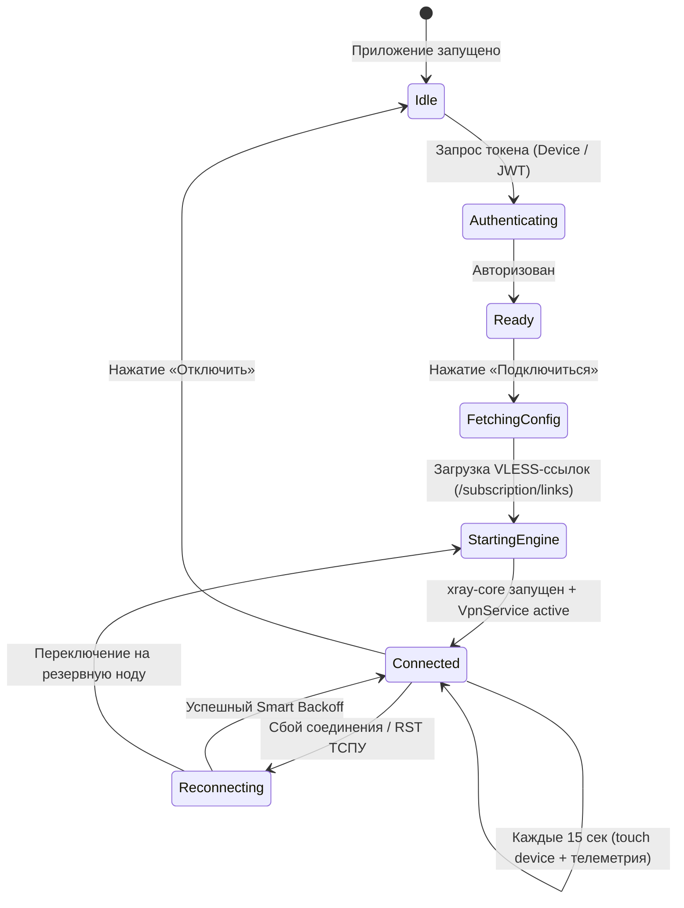

# Клиентская Экосистема: Обзор платформ

NextGen VPN предоставляет согласованный пользовательский опыт на всех основных операционных системах благодаря продуманному разделению ответственности: клиентские приложения отвечают за локальный захват трафика и запуск движка `xray-core`, в то время как выбор оптимального сервера и конфигурация маршрутизации централизованно управляются бэкендом.

---

## 1. Сравнительный анализ платформ

| Платформа | Стек технологий | Способ захвата трафика | Авторизация | Фоновый режим |
|---|---|---|---|---|
| **Android** | Java 17, Material 3, `libXray.aar` | Системный интерфейс `android.net.VpnService` (TUN виртуальный интерфейс) | Email, Google Sign-In, 1-Click Device UUID | `ForegroundService` с постоянным уведомлением |
| **Desktop** (macOS, Windows, Linux) | Electron 34, React 18, TypeScript, Vite | Системный HTTP/SOCKS5 прокси (`networksetup`, WinINet, GSettings) | Email/пароль, Device UUID, Google OAuth Loopback | Сворачивание в системный трей (System Tray) |
| **Web SPA** | React 18, Tailwind CSS, PrimeReact | — (Управление аккаунтом, биллинг, генерация VLESS) | Email, Web Handoff SSO, Telegram WebApp | Работает в браузере и Telegram Mini App |
| **Admin Console** | React 18, Tailwind, Lucide, Recharts | — (Дашборд, метрики ТСПУ, управление нодами и пользователями) | Admin JWT (`role == 'ADMIN'`) | Доступен по защищенному маршруту `/admin` |

---

## 2. Общая схема работы клиентского приложения

---

## 3. Инварианты клиентских приложений

1. **Защита от сетевых петель (`protect()` / Bypass)**:
   * На Android все сокеты обращения к API сервера управления и DoH резолверам явно защищаются методом `VpnService.protect(fd)`.
   * На Desktop системный прокси исключает трафик к локальным петлевым адресам (`127.0.0.1`, `localhost`) и внутренним подсетям RFC 1918.
2. **DoH Fallback**:
   * Если системный DNS провайдера подменяет IP-адрес сервера авторизации, клиент автоматически переключается на встроенный резолв через Cloudflare DoH (`https://1.1.1.1/dns-query`).
3. **Бесшовное пополнение**:
   * В соответствии с политиками Google Play, клиенты не запрашивают платежные данные внутри приложения, а инициируют переход в браузер через одноразовый SSO-код `web-handoff`.
