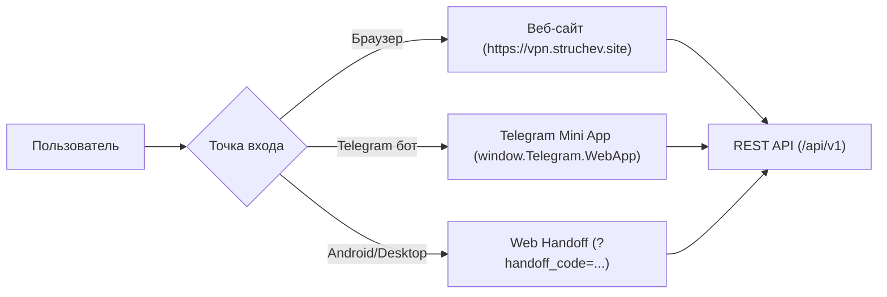

# Web SPA & Панель Администратора

Исходный код: `web/src/` (Пользовательский кабинет и Telegram Mini App) и `web/src/admin/` (Панель администратора).

---

## 1. Пользовательский веб-кабинет (Web SPA)

Веб-приложение NextGen VPN спроектировано как универсальный адаптивный интерфейс (PWA), способный функционировать как в обычном браузере, так и внутри Telegram в режиме **Telegram Mini App (TMA)**:



### Ключевые возможности пользователя:
* **Адаптивный профиль**: индикация остатка дней подписки, круговой счетчик израсходованного трафика и статус активного тарифа.
* **Кабинет устройств**: список подключенных телефонов и ноутбуков с возможностью отозвать потерянное устройство в один клик.
* **Центр пополнения баланса**: генерация крипто-инвойсов TRC-20 / EVM с автоматическим таймером и кнопкой клейма транзакции.
* **Реферальный центр**: копирование ссылки для друзей, отслеживание количества переходов и начисленных бонусов.

---

## 2. Панель Администратора (`/admin`)

Панель администратора встроена в веб-приложение и активируется только при наличии у авторизованного пользователя роли `ADMIN`.

```
/admin
├── 📊 Дашборд (DashboardView)
│   ├── Финансовые метрики (MRR, балансы, реферальные выплаты)
│   ├── Мониторинг пропускной способности (Mbps / Суммарный трафик)
│   └── Матрица деградации ТСПУ (сбои по операторам связи РФ)
│
├── 🖥 Ноды и Серверы (NodesSection)
│   ├── Live-мониторинг CPU, RAM, Uptime и активных сокетов
│   ├── Генератор одноразовых Bootstrap-токенов установки
│   ├── Управление пулами (paid, trial, quarantine)
│   └── Отправка бинарных команд агентам (Restart Xray, Drain, Reconcile)
│
├── 👥 Пользователи (UsersSection)
│   ├── Поиск по email, ID, Telegram ID и Device UUID
│   ├── Ручная корректировка баланса (с фиксацией причины)
│   ├── Продление подписки на произвольное число дней
│   └── Блокировка аккаунта с отзывом сессий
│
├── ⚙️ Политики транспорта (PoliciesSection)
│   ├── Управление доменами маскировки Reality (SNI / Dest)
│   └── Переключение глобального резервного транспорта (gRPC / CDN)
│
└── 🪙 Сверка платежей (PaymentsSection)
    └── Ручное зачисление депозитов по хешу блокчейна
```

---

## 3. Матрица деградации ТСПУ в реальном времени

В дашборд администратора интегрирована аналитическая таблица телеметрии соединений, собираемая клиентскими приложениями при ошибках:

| Оператор | Регион | Транспорт | Запросов (24ч) | Сбоев | Ошибок, % | Средний пинг | Признак белого списка |
|---|---|---|:---:|:---:|:---:|:---:|:---:|
| **МТС** | RU-MOW (Москва) | `xhttp` | 5 400 | 27 | 0.5% | 145 ms | Нет |
| **Ростелеком** | RU-SPE (СПб) | `grpc` | 310 | 90 | **29.0%** | 420 ms | ⚠️ Возможен |
| **МегаФон** | RU-SVE (Екатеринбург)| `xhttp` | 1 820 | 12 | 0.6% | 180 ms | Нет |
| **Дом.ru** | RU-NIZ (Нижний Новгород)| `xhttp`| 940 | 8 | 0.8% | 160 ms | Нет |

При росте процента сбоев выше 20% администратор может в один клик изменить домен маскировки или активировать аварийный CDN fallback для проблемного оператора.
