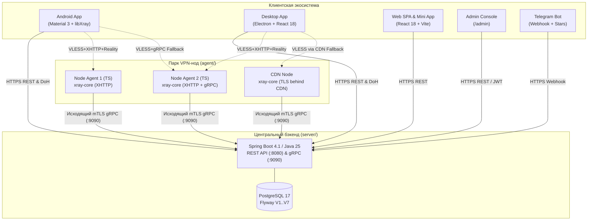

## Быстрый старт по разделам

::: tip ВАЖНОЕ ПРИМЕЧАНИЕ О СТАТУСЕ ДОКУМЕНТАЦИИ
Этот портал документации скомпилирован на основе реальной кодовой базы монорепозитория (`server/`, `agent/`, `android/`, `desktop/`, `web/`, `proto/`). Все файлы портала находятся в рабочей директории без фиксации в git-историю (`git commit` не выполнялся).
:::

### Карта системы

---

### Навигатор по порталу

| Раздел | Ссылка | Ключевые темы |
|---|---|---|
| **API Reference** | [/api-reference/overview](/api-reference/overview) | **Главный раздел**: REST DTO, cURL, коды ошибок, JWT, OpenAPI 3.1, gRPC `agent.proto`. |
| **Аутентификация** | [/api-reference/auth-api](/api-reference/auth-api) | `/register`, `/login`, `/device` (анонимный UUID), `/google`, `/telegram`, `/upgrade`. |
| **Пользовательский API** | [/api-reference/user-api](/api-reference/user-api) | `/profile`, `/devices`, `/subscription/links`, `/regions`, `/tariffs`, `/balance-history`. |
| **Биллинг & Handoff** | [/api-reference/billing-api](/api-reference/billing-api) | `/billing/invoice`, `/purchase`, `/claim-tx`, Web Handoff SSO `/auth/web-handoff`. |
| **Control Plane API** | [/api-reference/admin-api](/api-reference/admin-api) | `/admin/dashboard`, `/nodes`, `/nodes/bootstrap-token`, `/users`, `/policies`, `/crypto/reconcile`. |
| **gRPC Контракт** | [/api-reference/grpc-agent-proto](/api-reference/grpc-agent-proto) | Спецификация `agent.proto`, стрим метрик, добавление пользователей на лету. |
| **Архитектура** | [/architecture/overview](/architecture/overview) | Архитектурный обзор, VLESS+XHTTP+Reality, mTLS оркестрация, Zero-Logs. |
| **Клиенты** | [/clients/overview](/clients/overview) | Специфика Android (VpnService), Desktop (Electron proxy), Web (SPA). |
| **Исследования** | [/research-and-compliance/ru-blocking](/research-and-compliance/ru-blocking) | Механика ТСПУ, модель трёх сигналов по «И», ст. 14.3 КоАП, Google Play Data Safety. |
| **Технический аудит** | [/audit/bugs-and-observations](/audit/bugs-and-observations) | Аудит безопасности: баг double-spend в крипто-платежах, bypass блокировок, 500 NPE. |
