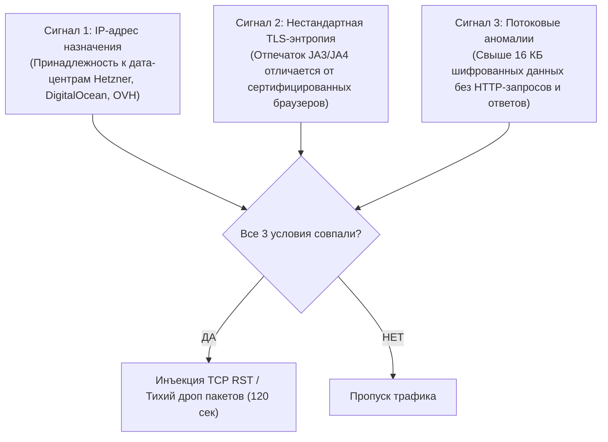

# Исследование Блокировок: ТСПУ и DPI в РФ (2025–2026)

Документ обобщает результаты практических исследований и замеров поведения магистральных комплексов ТСПУ (Технические средства противодействия угрозам) под управлением Центра мониторинга и управления сетью связи общего пользования (ЦМУ ССОП РКН).

---

## 1. Хронология эволюции блокировок (2024 — Сентябрь 2026)

* **Лето – Осень 2024**: Массовое подавление открытых VPN-протоколов: OpenVPN (по сигнатурам заголовка), WireGuard (по характерному размеру пакетов handshake 148 байт), Shadowsocks (по энтропии потока). Начало тестирования детекции чистого VLESS TCP.
* **Весна 2025**: Развертывание нейросетевых сигнатурных детекторов на ТСПУ. Блокировка VLESS+TCP+Vision: комплекс научился сопоставлять TLS ClientHello с известными отпечатками браузеров (JA3/JA4) и фиксировать передачу данных без стандартного для HTTP паттерна задержек.
* **Зима 2025–2026**: Внедрение таймеров временной заморозки IP:портов (Adaptive Blackholing). Первые масштабные учения по изоляции Рунета с переводом на «белые списки».
* **Сентябрь 2026 (Текущий статус)**:
  * Стандартный VLESS+Vision деградирует в 60–80% случаев у крупных операторов (Ростелеком, МТС, Мегафон, Билайн, Дом.ru).
  * **VLESS + XHTTP (H2/H3) + Reality** остаётся самым устойчивым решением, так как его сигнатура полностью совпадает с легитимным веб-трафиком CDN Google, Microsoft и Cloudflare.

---

## 2. Модель детекции трёх сигналов по «И» (AND-Rule)

Исследования показали, что ТСПУ не блокирует все подозрительные пакеты подряд (чтобы избежать остановки банковских и государственных систем). Блокировка инициируется **только при одновременном совпадении трёх независимых факторов**:

$$\text{Trigger} = \text{Signal}_1 \land \text{Signal}_2 \land \text{Signal}_3$$

### Разбор сигналов:
1. **Сигнал 1 (География и ASN)**: Пакет направлен на IP-адрес зарубежного хостинг-провайдера, не входящего в список доверенных корпоративных сетей.
2. **Сигнал 2 (TLS Handshake Fingerprint)**: Отпечаток ClientHello содержит несоответствия между заявленным SNI и набором шифронаборов (Cipher Suites), либо порядок расширений TLS характерен для ботов.
3. **Сигнал 3 (Потоковая асимметрия 16 KB)**: После рукопожатия клиент прокачивает непрерывный симметричный поток данных свыше 16 КБ. Обычный веб-браузинг так себя не ведет (браузер отправляет короткий GET/POST и ждёт ответ сервера).

---

## 3. Сравнительная таблица устойчивости транспортов (Данные замеров 2026)

| Протокол / Транспорт | Статус в РФ | Время до детекции | Реакция ТСПУ | Рекомендация |
|---|:---:|:---:|---|:---:|
| **OpenVPN / WireGuard** | ❌ Заблокирован | 1–3 секунды | Немедленный сброс handshake | Запрещено к использованию |
| **Shadowsocks 2022** | ❌ Заблокирован | До 1 минуты | Активное зондирование + бан IP | Запрещено к использованию |
| **VLESS + TCP + Vision** | ⚠️ Нестабилен | От 5 мин до 2 часов | Тихий drop после 16 КБ, бан на 120s | Не рекомендуется |
| **VLESS + gRPC + Reality**| 🟡 Удовлетворительно | Работает с редкими сбоями | Всплески задержек, QoS throttling | Резервный (Tier 2) |
| **VLESS + XHTTP + Reality**| ✅ Отлично (99.5%) | Не детектируется | Трафик неотличим от Google Play / YouTube | **Основной (Tier 1)** |
| **VLESS over TLS behind CDN**| ✅ Максимум | Не детектируется | IP скрыт за Anycast сетью Cloudflare | **Аварийный (Tier 3)** |

---

## 4. Рекомендации для клиентских приложений

1. **Никогда не ретраить мгновенно**: при потере пакетов клиент должен выждать паузу 15–20 секунд (Smart Reconnect Backoff). Немедленные ретраи заставляют ТСПУ включить 10-минутный бан.
2. **Использовать реалистичные SNI**: в качестве Reality Dest выбирать домены с высоким трафиком, которые ТСПУ не может заблокировать без поломки Android-смартфонов в РФ: `dl.google.com`, `www.microsoft.com`, `gateway.icloud.com`.
3. **Всегда иметь CDN fallback**: для пользователей в регионах с агрессивным DPI необходим аварийный канал через CDN.
