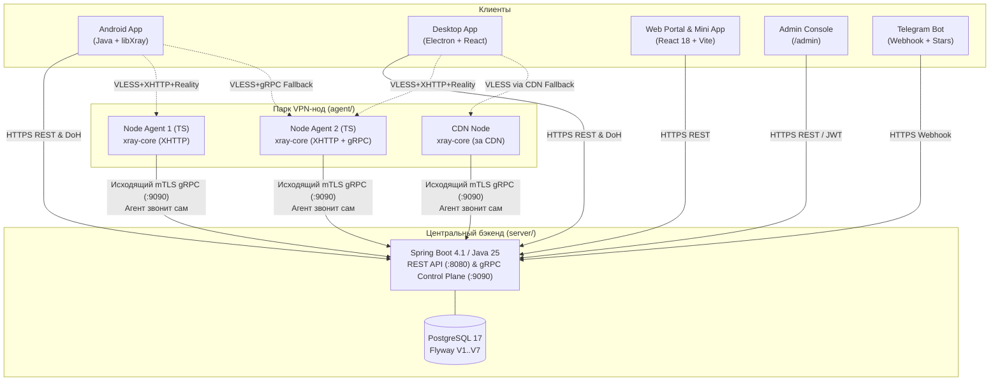

# Архитектура и системный дизайн NextGen VPN

Документ описывает архитектуру, технические решения, протоколы, модель данных и принципы работы сервиса NextGen VPN. Служит постоянным источником правды об устройстве системы.

---

## 1. Концепция и цели сервиса

**NextGen VPN** — высокоустойчивый к цензуре VPN-сервис, спроектированный для надёжной работы в условиях активного противодействия DPI (включая ТСПУ в РФ, GFW в Китае, цензуру в Иране).

### Ключевые архитектурные принципы:
1. **DPI-неразличимость (Stealth Transport)**: основной трафик маскируется под легитимный HTTP/2/3 веб-трафик к популярным зарубежным сайтам через протокол VLESS с транспортом XHTTP и маскировкой TLS Reality.
2. **Нулевое знание о трафике (Zero-Logs)**: серверы и ноды не сохраняют историю посещённых ресурсов, IP-адресов назначения и DNS-запросов (`access.log` в Xray отключён). Учитываются только агрегированные счётчики байтов для контроля квот.
3. **Автономность и финансовая независимость**: биллинг работает на криптовалютах (TRC-20 USDT, EVM ERC-20 USDT) и Telegram Stars без подключения централизованных эквайрингов или хранения банковских карт.
4. **Отказоустойчивость и централизованное управление политиками**: клиентские приложения не содержат жёстко зашитых конфигураций нод; параметры транспорта, TLS-отпечатки и резервные маршруты обновляются динамически через `transport_policy` с сервера без пересборки приложений.
5. **Изоляция скомпрометированных узлов**: ноды не имеют прямого доступа друг к другу и к базе данных; связь между нодой и сервером осуществляется исключительно через исходящий mTLS gRPC стрим со стороны ноды.

---

## 2. Стек технологий и фундаментальные инварианты

Проект построен по принципу монорепозитория со строгими технологическими правилами:

| Компонент | Стек технологий | Версии / Особенности |
|---|---|---|
| **Server** | Java 25 (LTS), Spring Boot 4.1.x, Spring Security, gRPC Java | Сборка через Gradle 8.12 (строго **Groovy DSL**, Kotlin DSL запрещён) |
| **Database** | PostgreSQL 17, Flyway 11 (миграции `V1`–`V7`) | Чистый PostgreSQL, без Redis (устранён как избыточный на раннем этапе) |
| **Node Agent** | TypeScript / Node.js, `@grpc/grpc-js`, дочерний процесс `xray-core` | Легковесный образ (~70 МБ), управление через Stats API |
| **Web & Admin** | React 18, Vite, TypeScript, Tailwind CSS, Lucide Icons | SPA с поддержкой i18n (ru/en), Telegram Mini App, веб-админка в `/admin` |
| **Android** | Java, Material 3, Android VpnService, `XTLS/libXray.aar` | Содержит собственный стейт-машин и DNS-over-HTTPS резолвер |
| **Desktop** | Electron, React 18, TypeScript, Tailwind CSS | Режим системного прокси (macOS, Windows, Linux GNOME), трей, автообновление |
| **Protobuf** | Proto v3 (`proto/vpn/agent/v1/agent.proto`) | Генерация типизированных классов для Java (`grpc-stub`) и TypeScript |

### Критические инварианты:
* **Финансовые расчеты**: баланс пользователя и цены тарифов хранятся и рассчитываются **строго в целочисленных микро-USDT** (`1 USDT = 1,000,000 micro-USDT`, тип `Long/int64`). Использование типов с плавающей точкой (`float`, `double`) категорически запрещено.
* **Приватность**: на узлах полностью отключен журнал доступа (`access.log`), приватные ключи Reality генерируются локально на ноде и не покидают её пределов.
* **Smart Reconnect Backoff**: при потере связи первая пауза составляет 15–20 секунд, смена ноды происходит только после 2–3 последовательных неудач. Это защищает сессию от удлинения блокировки ТСПУ со 120 до 600 секунд.

---

## 3. Архитектура монорепозитория

---

## 4. Сетевой транспорт и противодействие DPI / ТСПУ

Обоснование транспортных протоколов базируется на исследовании современных механизмов блокировок (см. [`research/ru-blocking.md`](research/ru-blocking.md)).

### 4.1. Основной транспорт: VLESS + XHTTP + Reality
* **VLESS**: легковесный протокол без избыточного шифрования (шифрование полностью обеспечивается TLS 1.3).
* **XHTTP (ранее SplitHTTP)**: трафик инкапсулируется в стандартные HTTP/2 или HTTP/3 POST/GET запросы. В отличие от сырого TCP-потока (TCP+Vision), XHTTP разбивает туннелируемый поток на независимые фрагменты с мультиплексированием (XMUX), делая невозможным сигнатурный анализ длины первых пакетов и временных интервалов.
* **Reality**: маскировка под сторонний домен (SNI stealing). Сервер перенаправляет неавторизованные TLS-запросы на реальный зарубежный сайт (например, `dl.google.com`, `gateway.icloud.com`), полностью имитируя его сертификат.
* **TLS Fingerprint**: строго фиксированные отпечатки популярных браузеров (`firefox` или `edge`). Случайные (random) фингерпринты запрещены, так как создают аномальные комбинации шифров, мгновенно детектируемые DPI.

### 4.2. Эшелонирование транспортов (Transport Fallback)
1. **Основной эшелон**: XHTTP + Reality на прямой IP-адрес ноды.
2. **Второй эшелон (gRPC fallback)**: если провайдер блокирует HTTP/2 или принудительно рвёт POST-потоки, клиент переключается на запасной порт ноды с gRPC-транспортом (`RoutingConfigResponse.grpcFallbackPort`).
3. **Аварийный эшелон (CDN-ноды)**: ноды типа `cdn`, трафик к которым маршрутизируется через проксирующие сети CDN (Cloudflare и аналоги). Обходит блокировку прямых IP-адресов.
4. **Честный детект ограничений оператора ("Белые списки")**:
   - Если мобильный оператор полностью изолирует внешний трафик (режим шатдауна), VPN бессилен.
   - Клиент выполняет параллельный зонд: проверяет доступность заведомо разрешённого хоста в зоне `.ru` и внешнего зарубежного хоста вне туннеля. При подтверждении «белого списка» пользователю выводится честный экран: *"Ограничение мобильного оператора, а не сбой VPN"*.

### 4.3. Защита от перечисления нод (Anti-Enumeration)
РКН и цензоры могут приобретать подписки для автоматического сбора и блокировки IP-адресов нод.
* Сервер выдаёт каждому клиенту подмножество из 3–5 нод вместо всего пула.
* `AntiEnumerationService`: логирует IP-адреса запросов на экспорт ссылок подписки. Если один аккаунт скачивает конфигурацию более чем с 5 уникальных IP-адресов в течение 60 минут, все VLESS-ключи аккаунта немедленно ротируются, делая полученный список недействительным.

### 4.4. Доступность API-сервера
* **Пул резервных доменов**: клиенты поддерживают список резервных доменов API (`ApiHostRotation`), последовательно перебираемых при сетевых сбоях.
* **DNS-over-HTTPS (DoH)**: системный DNS оператора не используется для резолва доменов API (применяется прямой DoH-запрос через Cloudflare JSON API).

---

## 5. Управление нодами и оркестрация

### 5.1. Архитектура Node Agent
Демон ноды реализован на TypeScript (`agent/`) и работает в изолированном контейнере:
* **Агент всегда звонит на сервер сам**: на ноде закрыты все входящие порты управления. Нода регистрируется по одноразовому bootstrap-токену и поднимает постоянный исходящий mTLS gRPC стрим к серверу.
* **Дочерний процесс `xray-core`**: агент генерирует конфигурацию Xray и запускает его бинарный файл.
* **Управление клиентами на лету**: добавление и удаление ключей пользователей происходит через gRPC Xray Command API (`HandlerService.AddUser` / `RemoveUser`) без перезапуска процесса Xray и без разрыва сессий других пользователей.
* **Сбор метрик**: агент опрашивает Stats API Xray каждые 10 секунд и передает серверу объем входящего/исходящего трафика по каждому пользователю, загрузку CPU/RAM и системный трафик.

### 5.2. Динамический роутинг и распределение нагрузки
Сервер ведет постоянный учет состояния узлов:
* Ноды разделены по пулам:
  * `trial`: для пользователей пробного периода (скорость может ограничиваться на уровне ОС ноды через `tc` / `fq_codel`);
  * `paid`: высокоскоростные ноды без шейпинга;
  * `quarantine`: ноды, показавшие высокий процент ошибок, автоматически выводятся из выдачи новым клиентам.
* **Мультифакторный скоринг (`V7`)**: выбор оптимальной ноды клиенту учитывает доступную пропускную способность, недавний throughput (`recent_egress_bytes_per_sec`), утилизацию памяти/CPU и геолокацию.

---

## 6. Модель данных и безопасность

### 6.1. Изоляция учетных данных
* **Уникальный ключ на тройку `(device, user, node)`**: для каждого устройства пользователя на каждой ноде генерируется независимый UUID (таблица `device_node_keys`). Компрометация ключа на одной ноде не дает доступа к другим нодам.
* **Лимиты устройств**: контролируются на сервере. При превышении лимита по тарифу старые устройства отзываются, а их ключи на нодах удаляются.

### 6.2. База данных (Flyway-миграции)
1. `V1__init.sql`: базовые таблицы пользователей (`users`), подписок (`subscriptions`), устройств (`devices`), нод (`nodes`), ключей (`device_node_keys`) и инвойсов (`crypto_invoices`).
2. `V2__billing_and_routing.sql`: балансовый журнал (`balance_entries`), политики транспорта (`transport_policies`), телеметрия (`conn_telemetry`).
3. `V3__round_annual_pricing.sql`: округление годовых цен для целочисленного чек-аута.
4. `V4__node_stats.sql`: история метрик нод (CPU, RAM, трафик).
5. `V5__reality_private_key.sql`: хранение открытых параметров Reality.
6. `V6__device_uuid.sql`: поддержка анонимных устройств без email.
7. `V7__node_recent_throughput.sql`: учет мгновенной скорости нод для динамического роутинга.

---

## 7. Биллинг, платежи и баланс

Биллинг построен по балансовой модели с предоплатой: пользователь пополняет единый баланс аккаунта в USDT, с которого списывается оплата подписки.

### 7.1. Рельсы пополнения баланса
1. **TRC-20 (Tron USDT)**:
   - Дефолтный крипто-рельс с низкой комиссией сети.
   - Фоновый сканер `BlockchainScannerTask` опрашивает TronGrid API на предмет входящих `Transfer`-событий контракта USDT.
2. **ERC-20 (EVM USDT)**:
   - Поддержка сетей Ethereum, Base, Arbitrum, Polygon через стандартный JSON-RPC (`eth_getLogs`) без тяжелых сторонних SDK.
   - Единый депозитный EVM-адрес для всех L2-сетей.
3. **Telegram Stars (`XTR`)**:
   - Оплата подписки внутри Telegram-бота и через веб-кабинет (через связывание `/telegram-link`).
   - Нулевая комиссия блокчейна для пользователя, моментальное зачисление.
4. **Web Handoff SSO**:
   - В мобильных и десктопных приложениях прямые формы оплаты отсутствуют (требование Google Play и упрощение комплаенса).
   - По кнопке «Пополнить баланс» генерируется защищенный одноразовый handoff-код, открывающий браузер с уже авторизованной сессией пользователя на странице биллинга.

### 7.2. Алгоритм идентификации депозитов (Случайный допуск)
Чтобы идентифицировать входящий перевод на единый кошелек без создания десятков адресов:
* К сумме инвойса добавляется уникальный микро-хвост: шаг `0.001 USDT`, случайный множитель `k ∈ [1..999]`.
* Окно допуска: **±0.0004 USDT**. Окна различных инвойсов не перекрываются, коллизии исключены.
* На баланс зачисляется фактически поступившая сумма (переплаты сохраняются на балансе пользователя).
* Механизм самообслуживания «Я оплатил, вот хеш»: позволяет пользователю моментально подтвердить транзакцию.

---

## 8. Клиентские приложения и веб-интерфейс

### 8.1. Android (`android/`)
* Нативное приложение на Java + Material 3.
* Интеграция `XTLS/libXray` (.aar, API v3).
* `VpnService` с защитой управляющих сокетов (`protect()`).
* Аутентификация: Email/пароль, Google Sign-In (Credential Manager), 1-click анонимный Device Auth.
* Селектор регионов с индикацией задержки и загруженности.

### 8.2. Desktop (`desktop/`)
* Кроссплатформенный клиент на Electron + React + TypeScript.
* Режим системного прокси: не требует административных привилегий ядра и сторонних TUN-драйверов; `xray-core` запускается локальным дочерним процессом.
* Управление системным прокси через ОС: `networksetup` (macOS), Registry (Windows), `gsettings` (Linux GNOME).
* Сворачивание в системный трей с контекстным меню и индикацией статуса туннеля.
* Аутентификация: Email/пароль, Google Sign-In (локальный loopback OAuth сервер), 1-click анонимный Device Auth.

### 8.3. Web-портал и панель администратора (`web/`)
* Публичный адаптивный лендинг с автоматическим выбором языка (RU/EN).
* Личный кабинет пользователя: управление подпиской, генерация ссылок, привязка Telegram Stars, список устройств.
* **Веб-панель администратора (`/admin`)**:
  1. *Dashboard*: системные метрики, график деградации в разрезе операторов и регионов.
  2. *Users*: поиск, блокировка, ручная корректировка баланса, управление устройствами.
  3. *Nodes*: статус mTLS-стримов, утилизация каналов, смена пулов, карантин.
  4. *Payments*: журнал инвойсов, сверка блокчейн-переводов.
  5. *Policies*: управление серверной политикой `transport_policy`.

---

## 9. Продуктовая модель, тарифы и рынки

### 9.1. Тарифная сетка и квоты

| Тариф | В месяц | За год (~−17%) | Трафик/мес | Устройств | Серверы / Приоритет |
|---|---|---|---|---|---|
| **Пробный (Trial)** | 0 | — | 1 ГБ (на 3 дня) | 1 | Общий пул `trial`, ограничение канала на ноде |
| **Basic** | $1 | $10 | 20 ГБ | 2 | Обычный пул `paid` |
| **Pro** | $2 | $20 | 100 ГБ | 5 | Приоритетный пул `paid`, скорость без ограничений |

* **1 ГБ / 3 дня — это пробный период, а не вечный бесплатный тариф**. Выдаётся строго один раз на аккаунт/устройство. Повторная активация отклоняется сервером.
* **Годовая скидка (~17%)**: решает проблему высоких комиссий в Ethereum mainnet (комиссия $1–3 осмыслена при чеке $10–20, но абсурдна при $1), снижает отток и формирует авансовый кэшфлоу.
* **Тарификация по объёму трафика без per-user шейпинга**: в системе намеренно отсутствует ограничение скорости («шейпинг») на каждого отдельного пользователя. Ограничение скорости на уровне Xray потребовало бы форка ядра или тяжелых очередей Linux `tc` на каждого пользователя, что кратно снижает производительность ноды по CPU. Вместо этого используются лимиты по устройствам, квоты трафика и потолок канала на весь пул `trial`.

### 9.2. Анализ рынков и экспансия

1. **Цензурные рынки (Primary Focus)**:
   * **РФ и русскоязычные страны СНГ/диаспора (Беларусь, Казахстан)**: ключевой стартовый рынок. Высокая потребность в DPI-устойчивом транспорте, привычка к Telegram, готовность использовать крипту и Stars.
   * **Иран**: второй целевой рынок. VLESS+Reality с транспортом XHTTP/gRPC технологически полностью закрывает потребности. Юридически обслуживание пользователей в Иране anti-censorship инструментами разрешено генеральной лицензией США (31 CFR §560.540, ранее GL D-2). Требует локализации на фарси с поддержкой RTL.
   * **Китай**: протокол VLESS+Reality+Vision/XHTTP эффективен против GFW, однако требует оптимизированных CN2/AS9929 каналов маршрутизации (обычные VPS дают неприемлемый пинг в часы пик) и поддержки Alipay/WeChat.
2. **Обычные privacy-рынки (США, ЕС)**:
   * Отсутствие DPI делает устойчивость XHTTP невостребованной. Высокая конкуренция с вендорами (NordVPN, Proton) и необходимость эквайринга карт через зарубежные юрлица делают рынок нерентабельным на раннем этапе.
3. **Запретные юрисдикции**:
   * Индия (законодательное требование вести логи пользователей), ОАЭ и Пакистан (лицензирование с обязательной деанонимизацией) противоречат модели Zero-Logs.

---

## 10. Юнит-экономика и инфраструктурные затраты

* **Параметры типового узла**: виртуальный сервер с каналом 1 Гбит/с и включенным трафиком 20 ТБ обходится в €5–15/мес (Hetzner, OVH, PQ, Scaleway и др.).
* **Емкость ноды**:
  * При средней утилизации канала 30–50% одна нода комфортно обслуживает **300–500 платных пользователей**.
  * Финансовый результат на ноду: при 300 платных абонентах с чеком $1–2/мес выручка составляет **$300–600/мес против затрат €5–15/мес**.
  * Пробных пользователей: до 15 000–20 000 на ноду в пуле `trial`.
* **Узкое место экономики**: узким местом являются не расходы на серверы или гигабайты, а **частота блокировок IP-адресов цензорами**. Итоговая рентабельность определяется скоростью и стоимостью ротации нод.

---

## 11. Управление рисками

| Риск | Механизм нейтрализации в архитектуре |
|---|---|
| Блокировка основного транспорта (XHTTP) | Динамическая смена транспорта и TLS-отпечатка с сервера через `transport_policy` без пересборки клиентов; включены gRPC и CDN fallback |
| Перечисление нод РКН через платную подписку | Выдача подмножества нод (3–5), ротация пулов, `AntiEnumerationService` (сброс ключей аккаунта при обращении с >5 IP за 60 мин) |
| Шатдаун / «Белые списки» оператора | Обойти технически невозможно. В клиентах встроен параллельный зонд белых списков и честный экран информирования пользователя |
| Блокировка управляющего домена API | Ротация пула резервных доменов (`ApiHostRotation`), обход системного DNS через Cloudflare DoH |
| Запрет рекламы VPN в РФ (ст. 14.3 КоАП) | Полный отказ от платной рекламы, позиционирование по шифрованию/приватности, 15% реферальная программа |
| Верификация Google Play Console | Подготовка соответствия Google Play Console (Data Safety, Privacy Policy) до релиза; наличие прямого обновления APK с сайта |
| Недоступность iOS без юрлица | Фокус на Android, Desktop и Telegram Mini App; для iOS предоставляется VLESS subscription-ссылка для сторонних клиентов |
| Перегрузка сервера одним пользователем | Квоты по трафику, ограничение числа устройств, `tc/fq_codel` на пуле `trial` |
| Невозвратный криптовалютный баланс | Прозрачный журнал `balance_entries`, уникальный микро-допуск ±0.0004 USDT, ручной клейм транзакции по хешу |

---

## 12. Связанная документация

* [`README.md`](README.md) — Навигатор по всей документации проекта.
* [`research/ru-blocking.md`](research/ru-blocking.md) — Исследование механизмов ТСПУ/DPI и обоснование протоколов.
* [`stores-and-liability.md`](stores-and-liability.md) — Юридический анализ, законодательство РФ и правила магазинов приложений.
* [`google-play-readiness.md`](google-play-readiness.md) — Чеклист и руководство по публикации в Google Play.
* [`BUGS_AND_OBSERVATIONS.md`](BUGS_AND_OBSERVATIONS.md) — Отчёт технического аудита кодовой базы.
