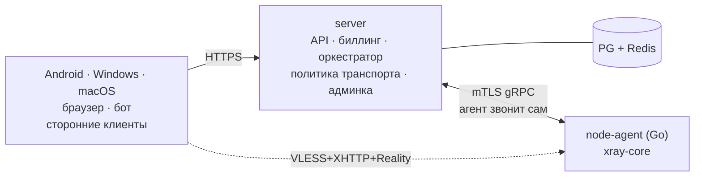

# VPN-сервис: план

Сентябрь 2026. Обоснование транспортных решений — [research/ru-blocking.md](research/ru-blocking.md). Магазины приложений и ответственность — [stores-and-liability.md](stores-and-liability.md).

## 1. Решения

| | |
|---|---|
| Протокол | XRay VLESS+Reality, основной транспорт **XHTTP** (не TCP+Vision) |
| Типы нод | `direct` (XHTTP+Reality) и `cdn` (XHTTP за CDN, аварийный путь) |
| Тарификация | **По трафику и числу устройств.** Ограничения скорости на пользователя нет (§4) |
| Оплата | Баланс в USDT. Пополнение: TRC-20 и ERC-20 на сайте, Telegram Stars в боте |
| Приём средств | Свой кошелёк, без юрлица и процессинга |
| Вход | Email+пароль, Google, Telegram |
| Клиенты | Android (Java), Windows/macOS (Electron+TS). xray подключается готовым артефактом — Go писать не нужно (§5). iOS заблокирован без юрлица |
| Сторонние клиенты | subscription-ссылка `vless://` — только платным |
| Фронтенд | React + Vite + Tailwind; общий пакет `ui/` для сайта, кабинета и десктопа |
| Репозиторий | Монорепо |
| Рост | Реферальная программа (в РФ платная реклама запрещена, §6) |
| Рынки | Старт: РФ и русскоязычные СНГ/диаспора. Второй — Иран. Китай — отдельная инвестиция (§2.1) |

## 2. Продукт

| Тариф | В месяц | За год (round, ~−17%) | Трафик/мес | Устройств | Серверы |
|---|---|---|---|---|---|
| Пробный | 0 | — | 1 ГБ | 1 | общие, с общим потолком канала |
| Basic | $1 | $10 | 20 ГБ | 2 | обычные |
| Pro | $2 | $20 | 100 ГБ | 5 | приоритетные, скорость не ограничена |

**1 ГБ — это пробный период, а не бесплатный тариф** (~час активного использования). Называть его «Бесплатный» не стоит: получим одно­звёздочные отзывы. Квоты в БД, меняются без деплоя. Квота месячная, при годовой оплате обнуляется ежемесячно. Пробный тариф выдаётся **один раз на аккаунт** — повторная активация/продление после того, как он когда-либо уже был на этом аккаунте (даже истёкший), отклоняется сервером (см. Пост-Фаза-10 в `docs/ROADMAP_PROGRESS.md`); иначе это была бы бесконечно продлеваемая бесплатная подписка, а не пробный период.

**Годовая подписка со скидкой решает сразу три задачи:** снижает частоту платежей там, где нет автосписания; делает Ethereum mainnet экономически осмысленным (комиссия $1–10 терпима при чеке $20, но абсурдна при $2); и даёт предоплату вперёд. Цена округлена до целого доллара для чистой суммы чек-аута ($10/$20, а не $9.6/$19.2) — это ~17%, а не ровно 20% от `monthly × 12`.

## 2.1 Рынки: где продавать

**Да, продавать вне РФ можно, и спрос там есть — технологически это тот же продукт.** VLESS+Reality стал дефолтным протоколом в проксях, которыми реально пользуются в России, Иране и Китае. В ядре нет ничего РФ-специфичного.

Но рынки делятся на два принципиально разных типа, и это важнее, чем кажется.

**Цензурные рынки** — Иран, Китай, Туркменистан, Мьянма, Беларусь, периодически Турция, Пакистан, Египет. Здесь наш продукт по сути готов: спрос высокий, мотивация острая, крипта в порядке вещей, а цена $1–2 конкурентна на фоне местных сервисов. Конкуренция есть, но она такая же кустарная, как мы.

**Обычные privacy-рынки** — ЕС, США, Латинская Америка. Здесь мы конкурируем с NordVPN, Surfshark и Proton, у которых маркетинговые бюджеты и партнёрские сети. Наше единственное преимущество — устойчивость к DPI — там никому не нужно, потому что ничего не блокируют. Без карт (нужно юрлицо) и без бренда шансы низкие. **Как стартовый рынок не рекомендую.**

### Что различается между странами

| | |
|---|---|
| **Транспорт** | Противники разные, и рабочие транспорты у них разные. В РФ TCP+Vision под ударом, а в Китае VLESS+Reality+Vision в начале 2026 показывал ~98% проходимости. То есть `transport_policy` со scope по региону — не РФ-костыль, а **ядро мультирыночного продукта**. Хорошо, что уже заложено |
| **Топология нод** | Для Ирана — Турция, ОАЭ, Германия. Для Китая — Япония, Корея, Гонконг, Сингапур, и там критична маршрутизация: обычный VPS даёт плохую скорость в час пик, нужны CN-оптимизированные каналы, а они заметно дороже. **Китай — это отдельная инвестиция, а не галочка в конфиге** |
| **Язык** | Английский обязателен. Для Ирана — фарси с **RTL**, а это реальная работа по вёрстке, а не строка в файле переводов. Для Китая — упрощённый китайский |
| **Оплата** | Крипта и Telegram Stars работают глобально — здесь мы в выигрыше. Карты требуют юрлица. В Китае без Alipay/WeChat конверсия низкая. В Иране карт нет вообще, крипта — норма, то есть нам даже удобнее |
| **Санкции** | Обслуживание иранских пользователей anti-censorship-инструментами **прямо разрешено**: 31 CFR §560.540, вобравший в себя GL D-2 в мае 2024. Юридического препятствия нет. Операционное есть: американские хостеры и сервисы всё равно часто режут иранский трафик |
| **Реклама** | Запрет на продвижение VPN — **РФ-специфичен**. Вне РФ реклама возможна, но в глобальной VPN-нише она очень дорогая, так что рефералка остаётся основным каналом по экономическим, а не правовым причинам |
| **Куда не идти** | Индия требует от VPN-провайдеров вести логи; ОАЭ и Пакистан вводят лицензирование и регистрацию. Эти рынки противоречат нашей модели без логов |

### Рекомендация

**Не размазываться.** Запуск — РФ плюс русскоязычные СНГ и диаспора (Беларусь, Казахстан): тот же язык, те же платёжные привычки, та же культура Telegram, добавление стоит почти ноль. Иран — второй рынок, с явными критериями перехода: готовый фарси с RTL и ноды в правильной географии. Китай — только если готовы вложиться в маршрутизацию и китайский язык.

**Что делаем сразу, чтобы не переписывать потом:** интернационализация с первого дня, а не «допишем позже» — английский как второй язык с самого начала, никаких РФ-допущений в модели данных, вёрстка, готовая к RTL. Это дёшево сейчас и дорого через полгода.

## 3. Стек

**Java 25 (LTS) + Spring Boot 4.1** — актуальные версии на сентябрь 2026. Spring Boot 4.1 вышел 10 июня 2026, минимум Java 17, первоклассная поддержка Java 25. Java 26 не LTS — для продакшн-сервиса не берём. Проект новый, миграционных издержек нет.

PostgreSQL, Redis, Flyway, Gradle · **React 19 + Vite + TypeScript + Tailwind** · Android на Java · desktop на Electron + React · нода — см. ниже.

> **Язык ноды — открытый выбор, и Go не обязателен.** Раньше я утверждал обратное: ограничитель скорости встраивался внутрь xray-core, и это требовало Go. От ограничителя мы отказались (§4) — аргумент отпал. Работа агента теперь простая: держать gRPC-стрим к серверу, запускать xray дочерним процессом, читать его Stats API, дёргать `nft` и `tc`. Это делается на чём угодно:
>
> - **TypeScript / Node** — вы его знаете (aurapad на нём), образ ~70 МБ, `@grpc/grpc-js` из коробки. **Рекомендую, раз Go не в активе.**
> - **Go** — образ 25 МБ, один статический бинарь, объективно лучший вариант для дешёвых VPS, но требует языка, которого нет.
> - **Java** — единообразие со стеком сервера, но ~300 МБ образа и ~250 МБ RSS на VPS с 512 МБ–1 ГБ памяти. Для этой роли худший из трёх.
>
> Контракт server ↔ agent в любом случае protobuf, так что язык агента можно поменять позже, не трогая сервер.

**Нода всегда звонит на сервер сама**, сервер на ноды не ходит: ноды работают за NAT, портов управления нет, компрометация одной не даёт доступа к остальным, замена ноды — это `docker run`. Последнее критично, замена нод будет постоянной (§6).

## 4. Тарификация без ограничения скорости

**Решение принято: отказываемся от лимита полосы на пользователя.** У xray-core его нет, и единственный работающий способ — форкать `app/dispatcher` и встраивать token bucket (как в XrayR). Это форк ~500 строк ядра с пересинхронизацией при каждом обновлении upstream, самый рискованный кусок проекта и две недели работы. Для дифференциации тарифов это дорого.

**Чем различаем тарифы вместо скорости:**

1. **Месячная квота трафика** — 1 / 20 / 100 ГБ. `StatsService` xray даёт счётчики на клиента, агент шлёт дельты каждые 30 с, превышение → отключение до следующего периода. Это уже есть в xray, реализуется сразу.
2. **Число устройств.** Каждое устройство получает **свой UUID** на ноде, поэтому лимит устройств проверяется на сервере при выдаче конфига — без всякого форка. Побочный плюс: статистика трафика становится подевайсной.
3. **Пул нод.** Пробные пользователи живут на отдельных, намеренно плотно заселённых нодах с общим потолком канала через `tc` на интерфейсе (одна строка конфига, не форк). Платные — на просторных. Разница в скорости получается сама собой, а `fq_codel` внутри даёт честное разделение между потоками, так что один тяжёлый пользователь не задавит остальных.

Разделение по пулам всё равно нужно было для защиты от перечисления нод (§6) — то есть эта механика достаётся почти бесплатно.

**Что теряем:** обещание «1 МБ/с» и «5 МБ/с» из маркетинга. Формулировки становятся честнее: Pro — «скорость не ограничена, приоритетные серверы». Вернуть per-user лимит можно позже — архитектура не мешает, диспетчер оборачивается независимо от остального.

## 5. Клиенты: что общего, что раздельно

**Go писать не придётся.** xray-core действительно написан на Go, и альтернатив нет — реализаций VLESS+Reality+XHTTP на Java или JavaScript не существует. Но его можно **потреблять готовым артефактом**, а не как исходники:

| Платформа | Как подключается xray | Нужен Go? |
|---|---|---|
| **Android** | готовый `.aar` из релизов `libXray` (или `AndroidLibXrayLite`, на нём построен v2rayNG) — обычная Java-зависимость | нет |
| **Windows / macOS** | официальный бинарь `xray` из релизов, запускается дочерним процессом, управляется JSON-конфигом и API — так устроены v2rayN, NekoRay, Hiddify Desktop | нет |
| **iOS** (позже) | `.xcframework` | нет |

Если нужной сборки не окажется в релизах, собрать её — это запустить документированный скрипт (`python3 build/main.py android`), а не писать на Go.

**От идеи общего ядра на Go отказываюсь.** Я предлагал его из соображения «логику обхода нельзя писать четыре раза». Пересмотрел, и аргумент оказался слабее, чем я его подал: почти вся эта логика — **параметры, а не код**, и они приходят с сервера. Список нод, транспорт, fingerprint, тайминги backoff — всё это серверная политика (§6). Собственного кода в клиенте остаётся порядка 800–1500 строк прямолинейной работы: кеш профиля, стейт-машина подключения, две HTTP-пробы для диагностики, DoH-резолв — а он встроен в OkHttp на Android и есть готовыми библиотеками в Node.

**Пишем нативно на каждой платформе:**

| Платформа | Язык логики | Оболочка |
|---|---|---|
| **Android** | Java | Material 3 — как вы просили |
| **Windows / macOS** | TypeScript | Electron, UI на React |
| **iOS** (позже) | Swift | SwiftUI + NetworkExtension |

**Дублирование компенсируем не общим кодом, а двумя вещами.** Первое — сервер остаётся единственным источником политики. Второе — общий **набор сценариев-тестов**, который каждая реализация обязана проходить в CI: «после обрыва не переподключаться раньше 15 секунд», «не менять fingerprint внутри сессии», «при доступном белом хосте и недоступном сером — показать экран ограничений оператора». Это даёт основную часть гарантии без общей кодовой базы.

**Второй слой переиспользования — дизайн, и он ценнее общего ядра.** Desktop на Electron с UI на React использует **тот же пакет компонентов и те же токены, что сайт и личный кабинет** — в монорепо это отдельный пакет `ui/`, который импортируют и веб, и десктоп. Продукт выглядит единым, а работы становится меньше.

### Desktop: самообновление без сертификата

Берём проверенную схему из вашего [aurapad](https://github.com/roman-struchev/aurapad): **electron-vite + electron-builder + electron-updater**, `publish: provider: github`, релизы и `latest.yml` на GitHub Releases, `mac.notarize: false`, NSIS для Windows. Схема у вас уже работает без подписи — переносим один в один, вместе со скриптом релиза.

**Режим работы MVP — системный прокси, а не TUN.** xray-core поднимается локальным SOCKS5/HTTP-прокси, клиент прописывает системные настройки прокси. Это принципиально: не нужны права администратора, драйверы и подпись кода — то есть автообновление остаётся простым ровно так, как в aurapad. Ограничение: покрываются браузеры и приложения, уважающие системный прокси.

TUN-режим (весь трафик системы) — отдельная опциональная задача позже: на Windows через WinTun, на macOS нужен привилегированный хелпер, и там уже всплывают подпись и Gatekeeper. Не тащим это в MVP.

**iOS** — заблокирован не техникой, а правилом Apple 5.4: VPN-приложения принимаются только от аккаунтов-организаций. Появится юрлицо — вернёмся. Подробности в [stores-and-liability.md](stores-and-liability.md).

## 6. Ограничения, которые меняют продукт

Детали и источники — в [research/ru-blocking.md](research/ru-blocking.md).

**Транспорт и fingerprint — серверная политика.** Волна блокировок разворачивается за часы, обновление в сторе — дни. Клиент получает профиль с сервера, зашит только аварийный fallback.

**Логика переподключения — часть архитектуры.** Наивное «оборвалось → быстро пробуем другую ноду и другой fingerprint» **удлиняет бан со 120 до 600 секунд**: детектируется сам паттерн адаптации. Отсюда: backoff с первой паузой 15–20 с, смена ноды не раньше 2–3 неудач, fingerprint/SNI/транспорт неизменны в рамках сессии, XMUX всегда включён, fingerprint только реальный (`firefox`/`edge`) — случайная генерация даёт невозможные комбинации, которые сами становятся сигнатурой.

**Коммерческий VPN блокируется легче самодельного**: РКН может купить подписку и перечислить ноды. Отсюда: подмножество из 3–5 нод на пользователя вместо всего парка · разные пулы · конфигурационное разнообразие вместо 50 одинаковых нод · детект перечисления (аккаунт тянет ссылку с многих IP → карантинный пул) · резервный пул IP, время замены ноды в минутах.

**Белые списки VPN не обходит в принципе.** Нужна диагностика в клиенте и боте: проба к «белому» и «серому» хосту, честный экран «это ограничение оператора, а не сервиса». Дёшево, снимает основную массу негатива.

**Клиент не зависит от DNS провайдера** (НСДИ обязательна, подмена штатна): DoH плюс пул IP.

**Реклама VPN — штраф по ст. 14.3 КоАП, физлицу 50–80 тыс. ₽.** Тексты сайта, сторов и бота — про приватность и шифрование, без «обхода блокировок» и названий заблокированных сервисов. Российские рекламные сети исключены. **Реферальная программа — обязательная функция MVP**, других каналов роста не остаётся. Ограничение РФ-специфично (§2.1), но вне РФ рефералка всё равно остаётся основным каналом — уже по экономическим причинам.

**Telegram запрещает продавать цифровые товары в боте за что-либо кроме Stars.** Бот — только Stars, крипта — только на сайте.

**В мобильном приложении не продаём ничего** — ни покупок, ни ссылок на оплату. Причина не только в правилах сторов: российские карты в Google Play всё равно не работают. Оплата на сайте и в боте.

## 7. Платежи и баланс

**Баланс решает главную проблему криптоплатежей.** Автосписания в крипте нет, а требовать ручной платёж каждый месяц — гарантированный отток. Поэтому:

- Пользователь пополняет **баланс в USDT** (микро-единицы, не float) на любую сумму. Все рельсы — TRC-20, ERC-20, Telegram Stars — зачисляют на один баланс.
- Подписка списывается с баланса, **продление автоматическое**, пока баланса хватает. Пополнил на $12 — год работает само.
- **Баланс не выводится.** Это надо написать крупно и до пополнения, а не в подвале оферты: берём деньги без возможности возврата — значит предупреждаем честно. У Telegram Stars есть собственный механизм возврата (`refundStarPayment`), его придётся соблюдать.

**Идентификация платежа — и да, дельту прощаем.** Уникальная сумма перестаёт быть ценой и становится **идентификатором**:

- шаг резервирования `0.001 USDT`, случайный `k ∈ [1..999]`, допуск **±0.0004** — окна не перекрываются, коллизий по построению нет;
- на баланс зачисляется **фактически пришедшая сумма**, а не номинал инвойса.

Это снимает почти все проблемы разом: **переплата** остаётся на балансе, **недоплата** просто зачисляется частично и пользователь докидывает, **двойная оплата** зачисляется дважды и не теряется. Промахи, которые не попали ни в одно окно (например, биржа удержала комиссию из суммы перевода), ловятся двумя механизмами: админская очередь неопознанных переводов и самообслуживание **«я оплатил, вот хеш»** — сервер проверяет получателя, сумму и то, что хеш ещё не зачтён, и кладёт на баланс сколько пришло.

**Рельсы:**
- **TRC-20 (Tron)** — по умолчанию: комиссия ~$0.3–1.5, единственный крипто-вариант, не абсурдный при чеке $1. Watcher по событиям `Transfer` контракта USDT, ~19 подтверждений.
- **ERC-20 (Ethereum)** — как просили. `EvmChainWatcher(rpcUrl, chainId, token, decimals, confirmations)`, поэтому Base/Arbitrum/Polygon включаются конфигом без нового кода. При годовой оплате mainnet становится осмысленным.
- **Telegram Stars** — нулевое трение, вероятно даст больше платежей, чем оба крипторельса. Комиссию и срок выплат проверить по документации на момент реализации.

Приватный ключ кошелька на сервере **не хранится** — сервер только читает блокчейн. Sweep не нужен: один адрес приёма на сеть.

## 8. Админка

Полноценный инструмент, а не заглушка:

- **Пользователи** — поиск и фильтры, карточка: подписка, баланс, устройства, потребление трафика по дням, история платежей; действия: продлить вручную, начислить на баланс, сбросить устройства, заблокировать.
- **Ноды** — статус, тип, пул, регион, ASN, аптайм, число клиентов, загрузка канала и CPU/RAM, версия агента, расхождение конфигурации; действия: вывести из выдачи, перевести в другой пул, форсировать реконсиляцию, удалить.
- **Дашборды** — выручка и MRR, конверсия пробный → платный, отток, распределение трафика, топ потребителей; **деградация в разрезе оператор × регион × транспорт** — главный операционный экран, по нему принимаются решения о смене транспортной политики.
- **Платежи** — все зачисления, очередь неопознанных переводов с привязкой к пользователю, заявки «я оплатил, вот хеш».
- **Управление** — тарифы и квоты, `transport_policy`, bootstrap-токены для нод, аудит-лог всех действий администратора.

Стек: PrimeReact — здесь скорость разработки важнее уникальности визуала, а таблицы и формы нужны готовые.

## 9. Дизайн

Сайт должен выглядеть спроектированным, а не собранным из шаблона. Порядок работы: **дизайн-система до вёрстки, макеты до фазы разработки веба.**

- **Дизайн-токены** — цвет, типографика, сетка, радиусы, тени, состояния; светлая и тёмная темы. Один источник истины для сайта, кабинета, desktop-приложения и Android (в `themes.xml` те же значения).
- **Лендинг** — кастомный на Tailwind + shadcn/ui, не шаблон. Позиционирование по §6: приватность, шифрование, скорость, честность про трафик.
- **Кабинет** — та же система, спокойный и плотный.
- **Desktop** — тот же пакет `ui/`, поэтому визуально это один продукт с сайтом, а не отдельное приложение.
- **Android** — Material 3 с теми же токенами; тёмная тема обязательна.
- **Интернационализация с первого дня.** Русский и английский сразу, вёрстка готова к RTL (фарси) — переделывать сетку под RTL потом дороже, чем заложить сейчас.
- Ключевой экран продукта — состояние подключения. Его прорабатываем отдельно: Disconnected / Connecting / Connected / Reconnecting / Error плюс честный экран ограничений оператора.

## 10. Ключевые решения по данным и нодам

- **UUID уникален для тройки (устройство, пользователь, нода)** — компрометация ноды раскрывает только её клиентов, ротация дешёвая, лимит устройств проверяется на сервере.
- У ноды есть `pool` (`trial` / `paid` / `quarantine`) и `transport` — из этого работают §4 и §6.
- `transport_policy` со scope `global | region | operator | user` — смена стратегии без деплоя.
- `balance_entries` — журнал начислений и списаний, а не одно поле: нужен аудит и разбор спорных случаев.
- `conn_telemetry` — оператор, регион, транспорт, время коннекта, доля обрывов, признак белых списков. Без адресов назначения.
- На ноде нет базы, email'ов и платёжных данных; `access log` xray отключён; приватный ключ Reality генерируется на ноде и наружу не уходит.
- Регистрация ноды: одноразовый bootstrap-токен → mTLS-сертификат → двунаправленный gRPC-стрим, применение конфигурации без рестарта xray, реконсиляция по хешу.

Схема БД целиком — в миграциях Flyway на фазе 0, здесь не дублируем.

## 11. Приватность

Не храним историю посещённых ресурсов, DNS-запросы и связку «пользователь → адрес назначения». Только агрегаты трафика за период — этого хватает для квот и не создаёт базы, которую опасно иметь.

## 12. Юнит-экономика

Нода за €5–15/мес (1 Гбит/с, 20 ТБ): по квоте Pro — 200 пользователей на полной, реально 400–600 при утилизации 30–50%. Планируем **~300 платных на ноду: $600/мес выручки против €10 расходов**. Пробных — до 20 000 на ноду.

**Узкое место не трафик и не деньги, а блокировки и замена нод.** Себестоимость определяется частотой ротации, а не гигабайтами.

## 13. Дорожная карта

Выручка появляется до готовности приложений: платным выдаётся subscription-ссылка, работающая в v2rayTun / Hiddify / Happ.

| Фаза | Что | Срок |
|---|---|---|
| 0 | Каркас: монорепо, `.proto`, Flyway, docker-compose, CI | 1 нед |
| 1 ⚠️ | Связность: регистрация ноды, gRPC-стрим, XHTTP+Reality → **проверяем, что трафик идёт и не отваливается через 120 с из реальной РФ-сети**. Самое рискованное — первым | 2–3 нед |
| 2 | Аккаунты, устройства, назначение на ноды, пулы, квоты через Stats API, subscription-ссылка | 2 нед |
| 3 | Баланс и оплата: инвойсы с допуском, Tron- и EVM-watcher, годовая скидка, автопродление с баланса, «я оплатил, вот хеш» | 2 нед |
| 4 | Telegram-бот: Stars, выдача подписки, автодиагностика, рефералка | 1.5 нед |
| | 🎯 **первые продажи** | ~7–9 нед |
| 5 | Дизайн-система, лендинг, личный кабинет, i18n (ru + en) | 2.5 нед |
| 6 | Админка: пользователи, ноды, нагрузка, дашборды | 1.5 нед |
| 7 | Android MVP: Java + `libXray` (.aar), логика подключения, конформанс-тесты | 3 нед |
| 8 | Desktop Windows/macOS: Electron, системный прокси, автообновление | 2 нед |
| 9 | Транспортная гибкость: `transport_policy`, gRPC, `cdn`-ноды | 2 нед |
| 10 | Закалка: резервные домены, антифрод, детект перечисления, нагрузка, верификация разработчика, Play-релиз | 2 нед |

**~19–21 неделя.** Отказ от лимитера убрал две недели и самый рискованный кусок, что окупило добавление desktop и админки.

**Бэклог:** TUN-режим на desktop · iOS (после юрлица) · AmneziaWG вторым семейством · возврат per-user лимита скорости, если понадобится.

> До релиза приложений пробный тариф публично не запускаем. Оффер — платные через subscription-ссылку. Альтернатива: 3-дневный триал по той же ссылке; решить перед фазой 3.

## 14. Риски

| Риск | Что делаем |
|---|---|
| Волна блокировок сносит основной транспорт | Транспорт и fingerprint с сервера без обновления клиента; готовы gRPC и CDN; в бэклоге AmneziaWG |
| РКН перечисляет ноды через купленную подписку | Подмножество нод, пулы, разнообразие конфигов, детект перечисления, резервный пул IP |
| Белые списки | Обойти нельзя. Диагностика, честная коммуникация, статусная страница вне РФ |
| Блокировка домена API | Пул доменов, DoH, пул IP, fallback в клиентах |
| Штраф за рекламу | Позиционирование по приватности, рост через рефералку |
| **Верификация разработчика Android с 2027** | APK с сайта перестанет ставиться на сертифицированные устройства без верифицированного разработчика. Пройти верификацию заранее, вместе с Play |
| Удаление из РФ-витрины Google Play | Play не единственный канал; APK и автообновление работают независимо |
| iOS недоступен | Правило Apple 5.4 требует юрлица. Осознанно откладываем |
| Один пользователь давит ноду | Квота + `fq_codel` + общий потолок `tc` на пробных нодах |
| Комиссия ERC-20 больше чека | Tron по умолчанию, годовая подписка, L2 конфигом, Stars без комиссии |
| Баланс невозвратный вызывает споры | Явное предупреждение до пополнения, журнал `balance_entries`, соблюдение правил возврата Stars |
| Работа без юрлица | Ваше решение. Карты и СБП недоступны, Play-аккаунт требует верификации личности, iOS закрыт, личная ответственность по ст. 14.3 |

## 15. Открыто

1. **География и число нод** — отложено. Ориентир: одна нода ≈ 300 платных.
2. **Бюджет** — отложено. Главная статья — ротация нод, не трафик.
3. **Пробный тариф до релиза приложений** — не запускать или 3-дневный триал. Решить перед фазой 3.
4. **Домен и бренд** — нужны к фазе 5, но домен и 2–3 резервных купить сейчас.
5. **Выбор CDN** — по замерам из российских сетей на фазе 9, не заранее.
6. **Статус верификации вашего Google Play аккаунта** — проверить сейчас, от него зависят оба канала дистрибуции.
7. **Второй рынок** — Иран после запуска или сначала выжать РФ и СНГ? Влияет только на приоритет фарси и географию нод, архитектуру не меняет.
